# Ansible AWX Tower

<div align="center">
  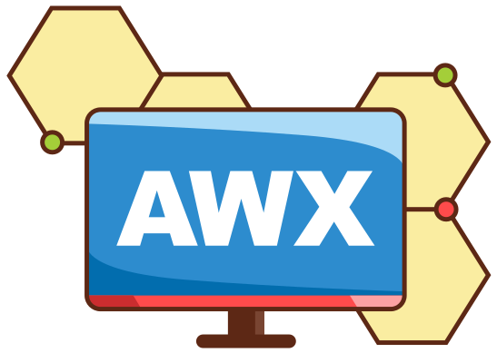
  <br><br>
  <p><strong>Centralize and control your IT infrastructure with a powerful web-based automation platform</strong></p>
</div>

## 🚀 About

In this HashiQube DevOps Lab, you'll get hands-on experience with **Ansible AWX Tower** - a web-based user interface, REST API, and task engine built on top of Ansible. AWX Tower provides a robust platform for:

- Managing credentials, inventories, projects, and playbooks
- Configuring AWX Tower using the CLI
- Triggering Ansible runs programmatically

AWX is the upstream open-source project for Red Hat Ansible Automation Platform, giving you enterprise-grade automation capabilities including:

- Visual dashboard for infrastructure management
- Role-based access control
- Job scheduling
- Integrated notifications
- Graphical inventory management
- REST API and CLI for integration with existing tools and processes

## 📋 Quick Start

<!-- tabs:start -->

### **Github Codespace**

[](https://codespaces.new/star3am/hashiqube?quickstart=1)

```bash
bash docker/docker.sh
bash minikube/minikube.sh
bash ansible-tower/ansible-tower.sh
```

### **Vagrant**

```bash
vagrant up --provision-with basetools,docker,docsify,minikube,ansible-tower
```

#### **Docker Compose**

```bash
docker compose exec hashiqube /bin/bash
bash bashiqube/basetools.sh
bash docker/docker.sh
bash docsify/docsify.sh
bash minikube/minikube.sh
bash ansible-tower/ansible-tower.sh
```

<!-- tabs:end -->

## 🔍 Access Information

After provisioning, you can access AWX Ansible Tower at:

- **URL**: <http://localhost:8043>
- **Username**: `admin`
- **Password**: Displayed at the end of the provisioning operation

<div align="center">
  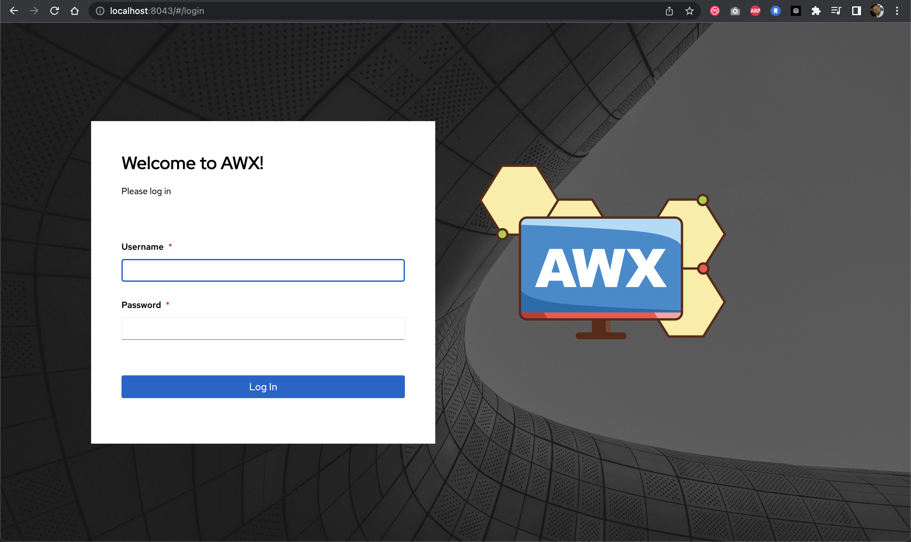
  <p><em>AWX Ansible Tower Dashboard</em></p>
</div>

<div align="center">
  
  <p><em>The login password is displayed at the end of the provisioning process</em></p>
</div>

## 🛠️ Working with AWX Tower

The following components were automatically configured during provisioning, but this guide will show you how to create them manually as well.

### Adding a Project

Projects in AWX Tower represent a collection of Ansible playbooks. You can connect to source control management (SCM) systems like Git.

<div align="center">
  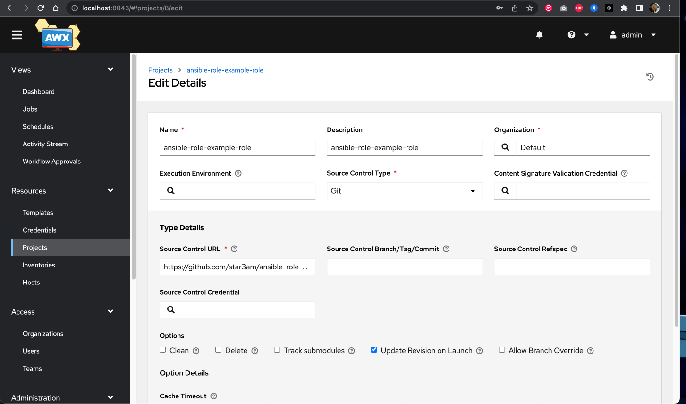
  <p><em>Creating a new project in AWX Tower</em></p>
</div>

```bash
# Command used during auto-provisioning:
sudo --preserve-env=PATH -u vagrant /home/vagrant/.local/bin/awx projects create \
  --organization 'Default' \
  --scm_update_on_launch true \
  --scm_url https://github.com/star3am/ansible-role-example-role \
  --scm_type git \
  --name ansible-role-example-role \
  --description ansible-role-example-role \
  --wait $AWX_COMMON
```

### Adding Credentials

Credentials allow AWX Tower to authenticate with the systems you're managing.

<div align="center">
  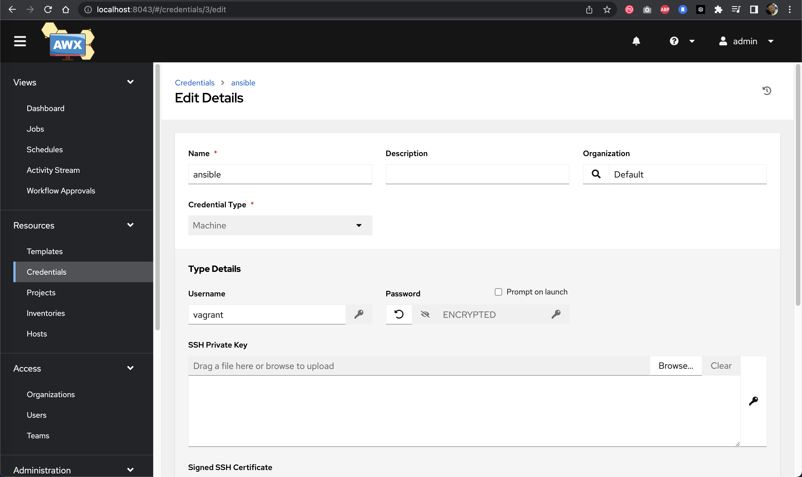
  <p><em>Creating machine credentials in AWX Tower</em></p>
</div>

```bash
# Command used during auto-provisioning:
sudo --preserve-env=PATH -u vagrant /home/vagrant/.local/bin/awx credentials create \
  --credential_type 'Machine' \
  --organization 'Default' \
  --name 'ansible' \
  --inputs '{"username": "vagrant", "password": "vagrant"}' \
  $AWX_COMMON
```

### Creating an Inventory

Inventories define the hosts and groups that AWX Tower will manage.

<div align="center">
  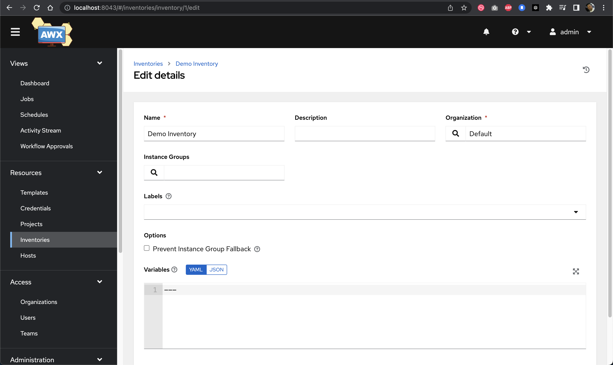
  <p><em>Creating a new inventory in AWX Tower</em></p>
</div>

```bash
# Command used during auto-provisioning:
sudo --preserve-env=PATH -u vagrant /home/vagrant/.local/bin/awx inventory create \
  --name 'Demo Inventory' \
  --description 'Demo Inventory' \
  --organization 'Default' \
  --wait $AWX_COMMON
```

### Setting Up a Job Template

Job templates combine projects, inventories, and credentials to create runnable automation tasks.

<div align="center">
  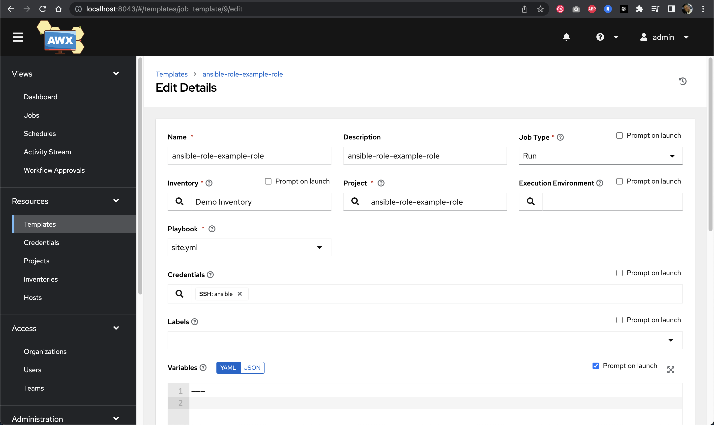
  <p><em>Creating a job template in AWX Tower</em></p>
</div>

<div align="center">
  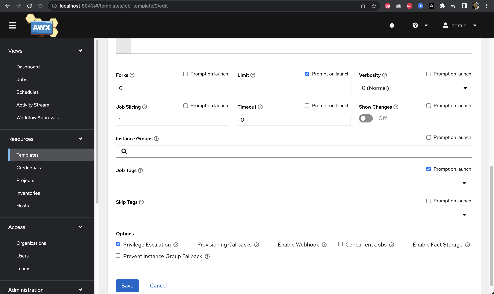
  <p><em>Additional job template settings for triggering capabilities</em></p>
</div>

```bash
# Command used during auto-provisioning:
sudo --preserve-env=PATH -u vagrant /home/vagrant/.local/bin/awx job_templates create \
  --name ansible-role-example-role \
  --description ansible-role-example-role \
  --job_type run \
  --inventory 'Demo Inventory' \
  --project 'ansible-role-example-role' \
  --become_enabled true \
  --ask_limit_on_launch true \
  --ask_tags_on_launch true \
  --playbook site.yml \
  --ask_variables_on_launch true \
  --wait $AWX_COMMON
```

## ▶️ Triggering Jobs

### Using the Callback URL

One powerful feature of AWX Tower is the ability to trigger jobs via API callbacks:

```bash
# SSH into Hashiqube
vagrant ssh

# Trigger an Ansible run via API callback
curl -s -i -X POST -H Content-Type:application/json \
  --data '{"host_config_key": "UL3H6uRtDozHA13trZudrUwUPBw4rSo7rRvi"}' \
  https://10.9.99.10:8043/api/v2/job_templates/9/callback/ -v -k
```

<div align="center">
  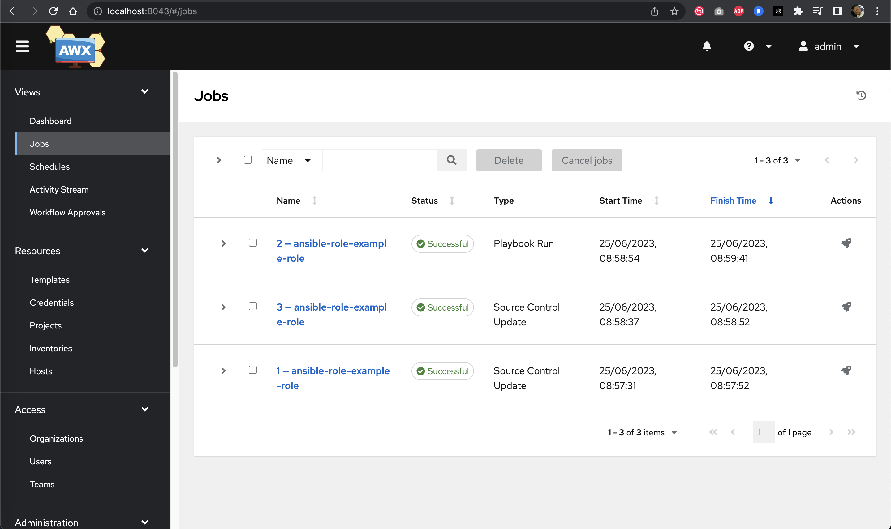
  <p><em>Jobs view showing successful job execution</em></p>
</div>

<div align="center">
  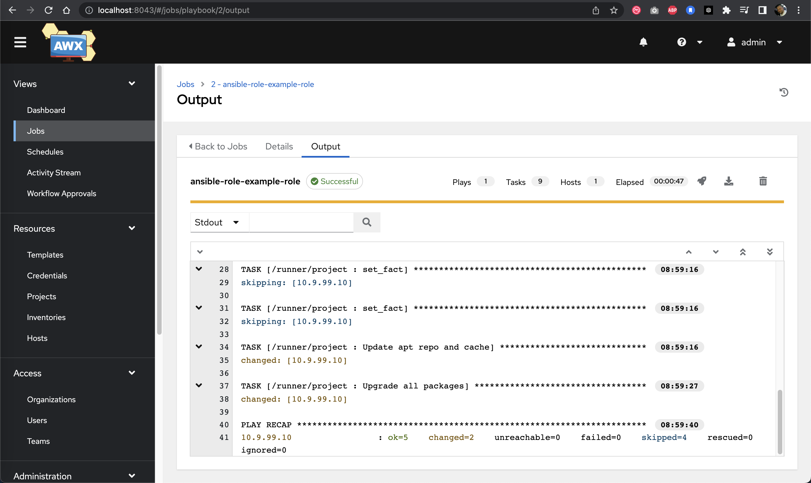
  <p><em>Detailed job execution information</em></p>
</div>

### Working with Windows Hosts

When working with Windows hosts, additional configuration is required:

<div align="center">
  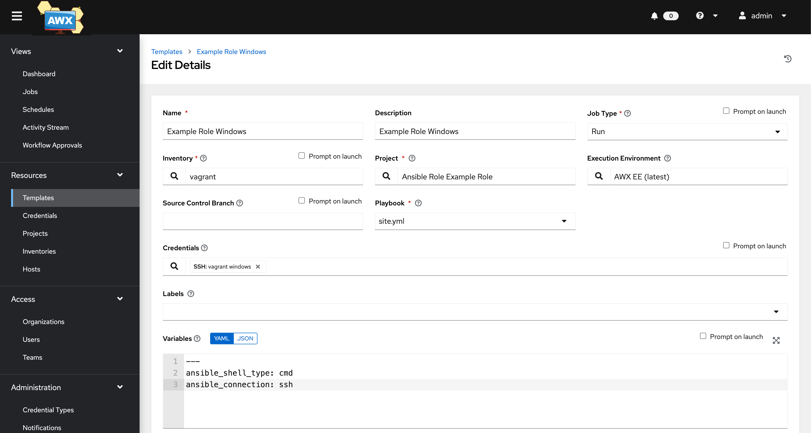
  <p><em>Creating a job template for Windows hosts</em></p>
</div>

<div align="center">
  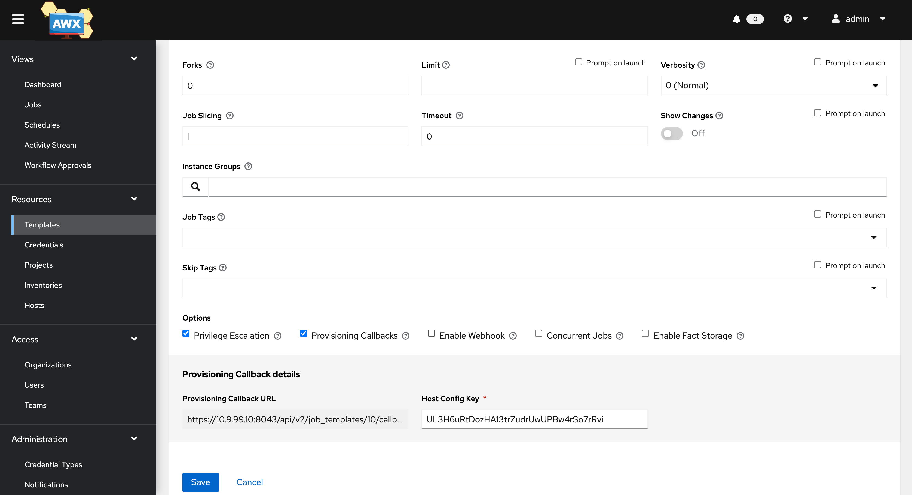
  <p><em>Extra variables needed for Windows automation</em></p>
</div>

```yaml
# Required extra variables for Windows hosts
ansible_shell_type: cmd
ansible_connection: ssh
```

To trigger a Windows job via PowerShell:

```powershell
powershell.exe -Command "[Net.ServicePointManager]::SecurityProtocol = [Net.SecurityProtocolType]::Tls12;[System.Net.ServicePointManager]::ServerCertificateValidationCallback = { $true };Invoke-WebRequest -UseBasicParsing -Uri https://10.9.99.10:8043/api/v2/job_templates/10/callback/ -Method POST -Body @{host_config_key='UL3H6uRtDozHA13trZudrUwUPBw4rSo7rRvi'}"
```

<div align="center">
  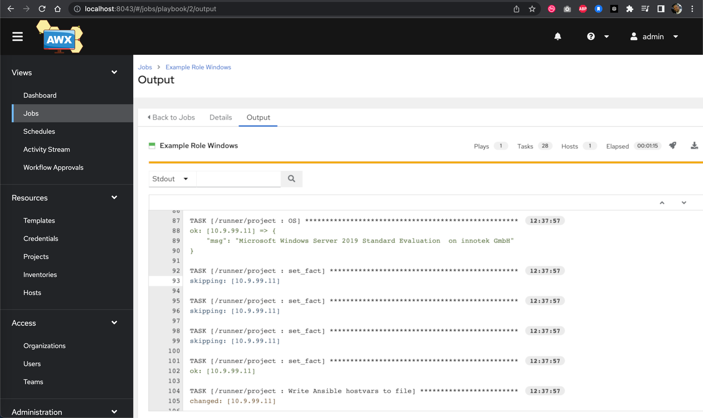
  <p><em>Windows job execution details</em></p>
</div>

## 🧰 Using AWX CLI

AWX CLI provides a powerful way to interact with AWX Tower from the command line, making it ideal for integration with CI/CD pipelines:

```bash
# Install the CLI tools
pip3 install awxkit         # For AWX
pip3 install ansible-tower-cli  # For Ansible Tower

# Example: Launch a job template and monitor its status
awx --conf.host https://10.9.99.10:8043 -f human job_templates launch 9 \
  --monitor --filter status --conf.insecure \
  --conf.username admin --conf.password password
```

## 🔄 Integration with Terraform

You can easily integrate AWX Tower with Terraform for infrastructure automation:

```hcl
locals {
  timestamp = timestamp()
}

resource "null_resource" "awx_cli" {
  triggers = {
    timestamp = local.timestamp
  }

  provisioner "remote-exec" {
    inline = [
      "/home/vagrant/.local/bin/awx --conf.host https://10.9.99.10:8043 -f human job_templates launch 9 --monitor --filter status --conf.insecure --conf.username admin --conf.password password",
    ]

    connection {
      type     = "ssh"
      user     = "vagrant"
      password = "vagrant"
      host     = "10.9.99.10"
    }
  }

  provisioner "local-exec" {
    command = "/usr/local/bin/awx --conf.host https://10.9.99.10:8043 -f human job_templates launch 9 --monitor --filter status --conf.insecure --conf.username admin --conf.password password"
  }
}
```

## 📚 Additional Resources

- [AWX GitHub Repository](https://github.com/ansible/awx)
- [AWX Installation Guide](https://github.com/ansible/awx/blob/devel/INSTALL.md)
- [Ansible Tower Documentation](http://docs.ansible.com/ansible-tower/index.html)
- [Custom Credentials in Ansible Tower](https://www.ansible.com/blog/ansible-tower-feature-spotlight-custom-credentials)
- [Ansible Official Website](https://www.ansible.com/)
