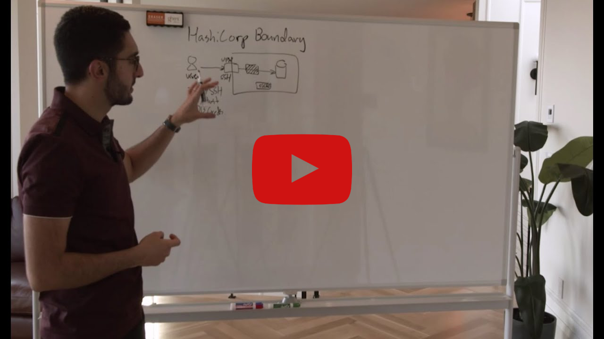

# HashiCorp Boundary

<div align="center">
  
  <br><br>
  <p><strong>Secure access to applications and infrastructure based on user identity</strong></p>
</div>

## 🚀 About

In this HashiQube DevOps lab, you'll get hands-on experience with HashiCorp Boundary, an identity-based secure access management solution.

Boundary is designed to grant access to critical systems using the principle of least privilege, solving challenges organizations encounter when users need to securely access applications and machines. Traditional products that grant access to systems are cumbersome, painful to maintain, or are black boxes lacking extensible APIs.

Boundary allows authenticated and authorized users to access secure systems in private networks without granting access to the larger network where those systems reside.

## 📰 Latest News

- [Boundary 0.12 introduces multi-hop sessions and SSH certificate injection](https://www.hashicorp.com/blog/boundary-0-12-introduces-multi-hop-sessions-and-ssh-certificate-injection)
- [Boundary 0.10 Expands Credential Management and Admin UI IAM Workflows](https://www.hashicorp.com/blog/boundary-0-10-expands-credential-management-and-admin-ui-iam-workflows)
- [HashiCorp Boundary 0.8 Expands Health and Events Observability](https://www.hashicorp.com/blog/hashicorp-boundary-0-8-expands-health-and-events-observability)

## 🎬 Introduction

<div align="center">
  <a href="https://www.youtube.com/watch?v=tUMe7EsXYBQ">
    
  </a>
  <p><em>Click the image to watch an introduction to HashiCorp Boundary by Armon Dadgar, HashiCorp Co-Founder and CTO</em></p>
</div>

## 🔍 How It Works

<div align="center">
  
  <p><em>Boundary architecture and workflow</em></p>
</div>

## 🖥️ User Interface

<div align="center">
  
  <p><em>Boundary login page</em></p>
</div>

<div align="center">
  
  <p><em>Boundary dashboard after login</em></p>
</div>

## 📋 Provision

<!-- tabs:start -->

### **Github Codespace**

[](https://codespaces.new/star3am/hashiqube?quickstart=1)

```bash
bash boundary/boundary.sh
```

### **Vagrant**

```bash
vagrant up --provision-with basetools,docsify,boundary
```

### **Docker Compose**

```bash
docker compose exec hashiqube /bin/bash
bash hashiqube/basetools.sh
bash docsify/docsify.sh
bash boundary/boundary.sh
```

<!-- tabs:end -->

## 🔑 Access Information

After provisioning, you can access Boundary at:

- **URL**: <http://localhost:9200>
- **Username**: admin
- **Password**: password

## 🛠️ Key Features

- **Identity-based access control** for users, services, and systems
- **Dynamic host catalogs** that automatically discover and register available targets
- **Just-in-time credential injection** for sessions
- **Multi-hop sessions** for secure access to remote networks
- **Fine-grained authorization** with role-based access control
- **Observability** through health checks and events monitoring
- **API-driven architecture** for automation and integration

## 🧩 Boundary Architecture Components

- **Controllers** - Manage the Boundary control plane
- **Workers** - Handle connections from clients to targets
- **Targets** - Resources that clients connect to through Boundary
- **Auth Methods** - Ways users can authenticate to Boundary
- **Projects** - Organizational units for targets
- **Host Catalogs** - Collections of hosts that can be used as targets
- **Sessions** - Active connections between clients and targets

## 📜 Provisioner Script

The script below automates the setup of Boundary in your HashiQube environment:

[filename](boundary.sh ':include :type=code')

## 🔗 Additional Resources

- [Boundary Official Website](https://www.boundaryproject.io/)
- [Boundary Documentation](https://www.boundaryproject.io/docs)
- [Boundary GitHub Repository](https://github.com/hashicorp/boundary)
- [Boundary Tutorials](https://learn.hashicorp.com/boundary)
- [Boundary CLI Reference](https://www.boundaryproject.io/docs/api-clients/cli)

[google ads](../googleads.html ':include :type=iframe width=100% height=300px')
