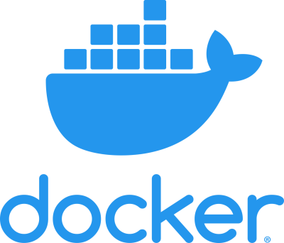

# Docker

<div align="center">
  
  <br><br>
  <p><strong>Containerize applications for faster deployment and scaling</strong></p>
</div>

## 🚀 About

In this HashiQube DevOps lab, you'll get hands-on experience with Docker. You'll learn how to:

- Build a custom Docker image from a Dockerfile
- Run Docker containers
- Configure a Docker daemon with authentication
- Set up a Docker registry

This lab follows the [official Docker installation guide](https://docs.docker.com/install/linux/docker-ce/ubuntu/) for Ubuntu-based systems.

## 📋 Provision

<!-- tabs:start -->

[](https://codespaces.new/star3am/hashiqube?quickstart=1)

```bash
bash docker/docker.sh
```

### **Vagrant**

```bash
vagrant up --provision-with basetools,docsify,docker
```

### **Docker Compose**

```bash
docker compose exec hashiqube /bin/bash
bash hashiqube/basetools.sh
bash docker/docker.sh
bash docsify/docsify.sh
```
<!-- tabs:end -->

## 📦 What You'll Build

When you run the provisioner, it will:

1. Install Docker on your HashiQube environment
2. Build an Apache 2.4 container from a Dockerfile
3. Run the container and expose it to your host machine
4. Make the container accessible at [http://localhost:8889](http://localhost:8889)

## 🛠️ Dockerfile Walkthrough

Below is the Dockerfile used to build the Apache web server container:

```dockerfile
FROM ubuntu:18.04

# Install dependencies
RUN apt-get update && \
 apt-get -y install apache2

# Install apache and write hello world message
RUN echo 'Hello World!' > /var/www/html/index.html

# Configure apache
RUN echo '. /etc/apache2/envvars' > /root/run_apache.sh && \
 echo 'mkdir -p /var/run/apache2' >> /root/run_apache.sh && \
 echo 'mkdir -p /var/lock/apache2' >> /root/run_apache.sh && \
 echo '/usr/sbin/apache2 -D FOREGROUND' >> /root/run_apache.sh && \
 chmod 755 /root/run_apache.sh

EXPOSE 80

CMD /root/run_apache.sh
```

This Dockerfile:

- Uses Ubuntu 18.04 as the base image
- Installs Apache web server
- Creates a simple "Hello World" web page
- Sets up a script to run Apache in the foreground
- Exposes port 80 for web traffic
- Specifies the command to run when the container starts

## 📊 Monitoring Docker

HashiQube includes Prometheus and Grafana for monitoring Docker containers.

For detailed information, see the [Monitoring Docker](prometheus-grafana/README?id=monitoring-docker) guide.

## 🧩 Key Docker Concepts

### Images vs Containers

- **Images**: Read-only templates used to create containers
- **Containers**: Runnable instances of images

### Basic Docker Commands

```bash
# List running containers
docker ps

# List all containers (including stopped ones)
docker ps -a

# List available images
docker images

# Pull an image from Docker Hub
docker pull ubuntu:latest

# Run a container
docker run -d -p 8080:80 --name my-container nginx

# Stop a container
docker stop my-container

# Remove a container
docker rm my-container

# Remove an image
docker rmi nginx
```

## 🔌 Docker Networking

Docker creates isolated networks for containers by default. You can:

- Create custom networks
- Connect containers to multiple networks
- Configure network settings

```bash
# Create a custom network
docker network create my-network

# Run a container connected to the custom network
docker run -d --network=my-network --name my-db postgres

# Connect an existing container to a network
docker network connect my-network my-container
```

## 📦 Docker Volumes

Volumes provide persistent storage for containers:

```bash
# Create a named volume
docker volume create my-data

# Run a container with a volume
docker run -d -v my-data:/data --name my-container ubuntu

# Mount a host directory as a volume
docker run -d -v /host/path:/container/path --name my-container ubuntu
```

## 🔍 Docker Provisioner

The script below automates the setup of Docker in your HashiQube environment:

```bash
#!/bin/bash

# Print the commands that are run
set -x

# Stop execution if something fails
set -e

# This script provisions Docker
# https://docs.docker.com/install/linux/docker-ce/ubuntu/

# Check if Docker exists
if ! [ -x "$(command -v docker)" ]; then
  echo 'Docker is not installed, installing it ...' >&2
  
  # Install prerequisites
  sudo apt-get install -y \
    apt-transport-https \
    ca-certificates \
    curl \
    gnupg-agent \
    software-properties-common

  # Add Docker's official GPG key
  curl -fsSL https://download.docker.com/linux/ubuntu/gpg | sudo apt-key add -

  # Add Docker repository
  sudo add-apt-repository \
   "deb [arch=amd64] https://download.docker.com/linux/ubuntu \
   $(lsb_release -cs) \
   stable"

  # Update packages and install Docker
  sudo apt-get update
  sudo apt-get install -y docker-ce docker-ce-cli containerd.io
  
  # Add current user to Docker group
  sudo usermod -aG docker vagrant

  # Create our Dockerfile
  cat << 'EOF' > /tmp/Dockerfile
FROM ubuntu:18.04
# Install dependencies
RUN apt-get update && \
 apt-get -y install apache2
# Install apache and write hello world message
RUN echo 'Hello World!' > /var/www/html/index.html
# Configure apache
RUN echo '. /etc/apache2/envvars' > /root/run_apache.sh && \
 echo 'mkdir -p /var/run/apache2' >> /root/run_apache.sh && \
 echo 'mkdir -p /var/lock/apache2' >> /root/run_apache.sh && \
 echo '/usr/sbin/apache2 -D FOREGROUND' >> /root/run_apache.sh && \
 chmod 755 /root/run_apache.sh
EXPOSE 80
CMD /root/run_apache.sh
EOF

  # Build our apache container
  sudo docker build -t apache /tmp/

  # Run our apache container
  sudo docker run -d --name apache -p 8889:80 apache
  
  echo "Docker installed successfully. Apache container running at http://localhost:8889"
else
  echo "Docker is already installed."
  
  # Check if apache container exists
  if [ ! "$(sudo docker ps -q -f name=apache)" ]; then
    if [ "$(sudo docker ps -aq -f status=exited -f name=apache)" ]; then
      # Cleanup
      sudo docker rm apache
    fi
    # Build our apache container if needed
    if [[ "$(sudo docker images -q apache 2> /dev/null)" == "" ]]; then
      # Create our Dockerfile
      cat << 'EOF' > /tmp/Dockerfile
FROM ubuntu:18.04
# Install dependencies
RUN apt-get update && \
 apt-get -y install apache2
# Install apache and write hello world message
RUN echo 'Hello World!' > /var/www/html/index.html
# Configure apache
RUN echo '. /etc/apache2/envvars' > /root/run_apache.sh && \
 echo 'mkdir -p /var/run/apache2' >> /root/run_apache.sh && \
 echo 'mkdir -p /var/lock/apache2' >> /root/run_apache.sh && \
 echo '/usr/sbin/apache2 -D FOREGROUND' >> /root/run_apache.sh && \
 chmod 755 /root/run_apache.sh
EXPOSE 80
CMD /root/run_apache.sh
EOF
      # Build our apache container
      sudo docker build -t apache /tmp/
    fi
    # Run our apache container
    sudo docker run -d --name apache -p 8889:80 apache
    echo "Apache container running at http://localhost:8889"
  else
    echo "Apache container is already running."
  fi
fi
```

## 🔗 Additional Resources

- [Docker Official Website](https://www.docker.com/)
- [Docker Documentation](https://docs.docker.com/)
- [Docker Compose Documentation](https://docs.docker.com/compose/)
- [Docker Hub](https://hub.docker.com/) - Repository for Docker images
- [Docker Best Practices](https://docs.docker.com/develop/develop-images/dockerfile_best-practices/)
- [Docker Cheat Sheet](https://www.docker.com/sites/default/files/d8/2019-09/docker-cheat-sheet.pdf)
