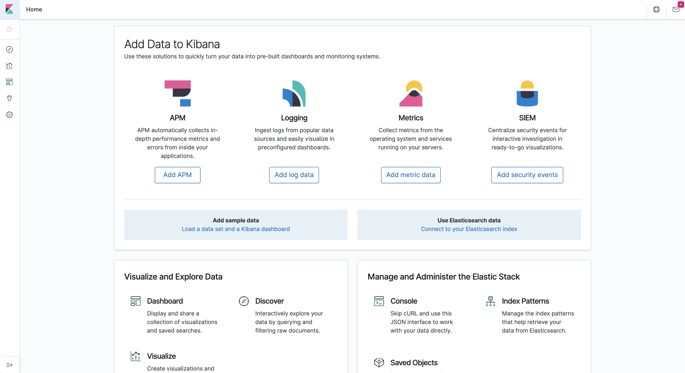
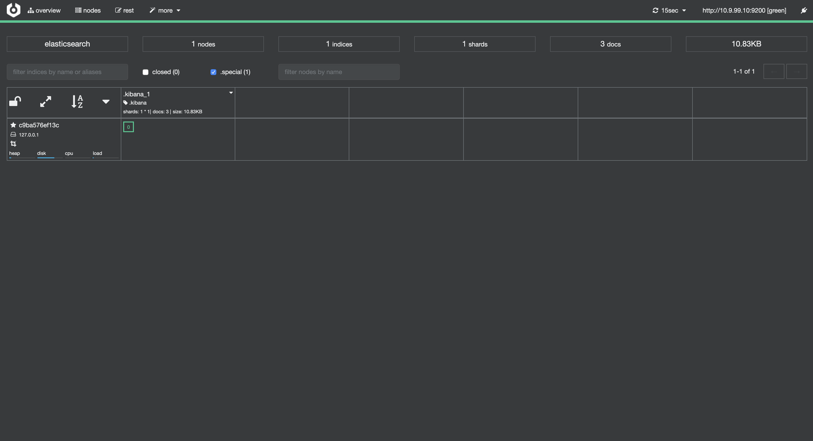

# Elasticsearch, Kibana, and Cerebro

<div align="center">
  <p><strong>Powerful search, visualization, and administration for your data</strong></p>
</div>

## 🔍 The ELK Stack Components

### Elasticsearch

<div align="center">
  
</div>

**Elasticsearch** is a distributed, open source search and analytics engine for all types of data, including textual, numerical, geospatial, structured, and unstructured. Built on Apache Lucene and first released in 2010 by Elasticsearch N.V. (now known as Elastic), it provides a powerful platform for storing, searching, and analyzing data at scale.

### Kibana

<div align="center">
  
</div>

**Kibana** is an open source analytics and visualization platform designed to work with Elasticsearch. You can use Kibana to search, view, and interact with data stored in Elasticsearch indices. It allows you to perform advanced data analysis and visualize your data in a variety of charts, tables, and maps, making complex data easy to understand.

### Cerebro

<div align="center">
  
</div>

**Cerebro** is an open source (MIT License) Elasticsearch web admin tool built using Scala, Play Framework, AngularJS, and Bootstrap. It provides a user-friendly interface for managing and monitoring your Elasticsearch clusters, allowing you to perform administrative tasks without having to use the command line.

## 📋 Provision

<!-- tabs:start -->

[](https://codespaces.new/star3am/hashiqube?quickstart=1)

```bash
bash docker/docker.sh
bash elasticsearch-kibana-cerebro/elasticsearch-kibana-cerebro.sh
```

### **Vagrant**

```bash
vagrant up --provision-with basetools,docker,docsify,elasticsearch-kibana-cerebro
```

### **Docker Compose**

```bash
docker compose exec hashiqube /bin/bash
bash hashiqube/basetools.sh
bash docker/docker.sh
bash docsify/docsify.sh
bash elasticsearch-kibana-cerebro/elasticsearch-kibana-cerebro.sh
```

<!-- tabs:end -->

## 🌐 Web Interfaces

After provisioning, you can access the web interfaces at:

### Kibana

- **URL**: [http://localhost:5601](http://localhost:5601)
- **Purpose**: Data visualization and Elasticsearch management

<div align="center">
  
  <p><em>Kibana dashboard interface for data visualization</em></p>
</div>

### Cerebro

- **URL**: [http://localhost:5602](http://localhost:5602)
- **Purpose**: Elasticsearch cluster administration

<div align="center">
  
  <p><em>Cerebro interface for Elasticsearch cluster management</em></p>
</div>

## 🔧 Key Features

### Elasticsearch

- **Distributed Search** - Scale horizontally for massive data volumes
- **Real-time Analytics** - Get insights from your data as it's ingested
- **Full-text Search** - Powerful search capabilities across all your content
- **Schema-free JSON** - Store data in flexible formats
- **RESTful API** - Easy integration with other applications
- **Multi-tenancy** - Isolate data and operations between users

### Kibana

- **Data Visualization** - Create dashboards with charts, graphs, and maps
- **Data Exploration** - Discover patterns and trends in your data
- **Monitoring** - Track the health and performance of your Elasticsearch clusters
- **Machine Learning** - Identify anomalies in your data (with X-Pack)
- **Security** - Control who can access your dashboards (with X-Pack)
- **Reporting** - Generate and share reports based on your visualizations

### Cerebro

- **Cluster Overview** - Monitor the health and status of your Elasticsearch clusters
- **Index Management** - Create, delete, and configure indices
- **Query Interface** - Execute queries against your Elasticsearch clusters
- **REST API Access** - Interact with the Elasticsearch REST API through a UI
- **Node Statistics** - View detailed performance metrics for each node

## 💡 Common Use Cases

1. **Log Analysis** - Centralize and analyze logs from multiple systems
2. **Application Search** - Add powerful search capabilities to your applications
3. **Security Analytics** - Detect and investigate security threats
4. **Business Analytics** - Gain insights from your business data
5. **Infrastructure Monitoring** - Track the health and performance of your IT infrastructure
6. **Geospatial Analysis** - Analyze location-based data

## 🔗 Additional Resources

- [Elastic Stack Documentation](https://www.elastic.co/products/elastic-stack)
- [Elasticsearch Documentation](https://www.elastic.co/guide/en/elasticsearch/reference/current/index.html)
- [Kibana Documentation](https://www.elastic.co/guide/en/kibana/current/index.html)
- [Cerebro GitHub Repository](https://github.com/lmenezes/cerebro)
- [Elastic Community](https://discuss.elastic.co/)
- [Elasticsearch: The Definitive Guide](https://www.elastic.co/guide/en/elasticsearch/guide/current/index.html)
