# GitLab

<div align="center">
  
  <br><br>
  <p><strong>A complete DevOps platform in a single application</strong></p>
</div>

## 🚀 About

GitLab provides a complete CI/CD toolchain in a single application. One interface. One conversation. One permission model. Thousands of features. GitLab simplifies DevOps by providing everything you need to build, test, deploy, and monitor your applications in one place.

## ⏱️ Setup Information

- **Duration**: 15-30 minutes
- **Requirements**: Your Docker daemon should have at least 12GB RAM
  - GitLab: 6GB
  - Minikube: 2GB
  - Operating System: 2GB
- **Process**: We'll bring up the Docker daemon and Minikube, then deploy GitLab on top of Minikube using Helm

## 📋 Provision

<!-- tabs:start -->

### **Github Codespace**

[](https://codespaces.new/star3am/hashiqube?quickstart=1)

```bash
bash docker/docker.sh
bash minikube/minikube.sh
bash gitlab/gitlab.sh
```

### **Vagrant**

```bash
vagrant up --provision-with basetools,docker,docsify,minikube,gitlab
```

### **Docker Compose**

```bash
docker compose exec hashiqube /bin/bash
bash hashiqube/basetools.sh
bash docker/docker.sh
bash docsify/docsify.sh
bash minikube/minikube.sh
bash gitlab/gitlab.sh
```

<!-- tabs:end -->

## 🖥️ Installation Process

During the installation, you can monitor progress via the Kubernetes Dashboard once Minikube is installed. Initially, you'll see some red indicators as GitLab pods and services start up, which will gradually turn green as the deployment completes.

- **Kubernetes Dashboard**: [http://localhost:10888/](http://localhost:10888/)

<div align="center">
  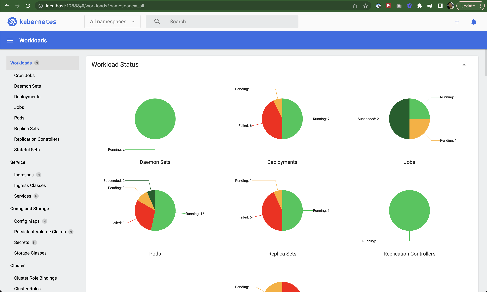
  <p><em>Minikube Dashboard showing GitLab deployment progress</em></p>
</div>

The GitLab provisioning process will look like this:

<div align="center">
  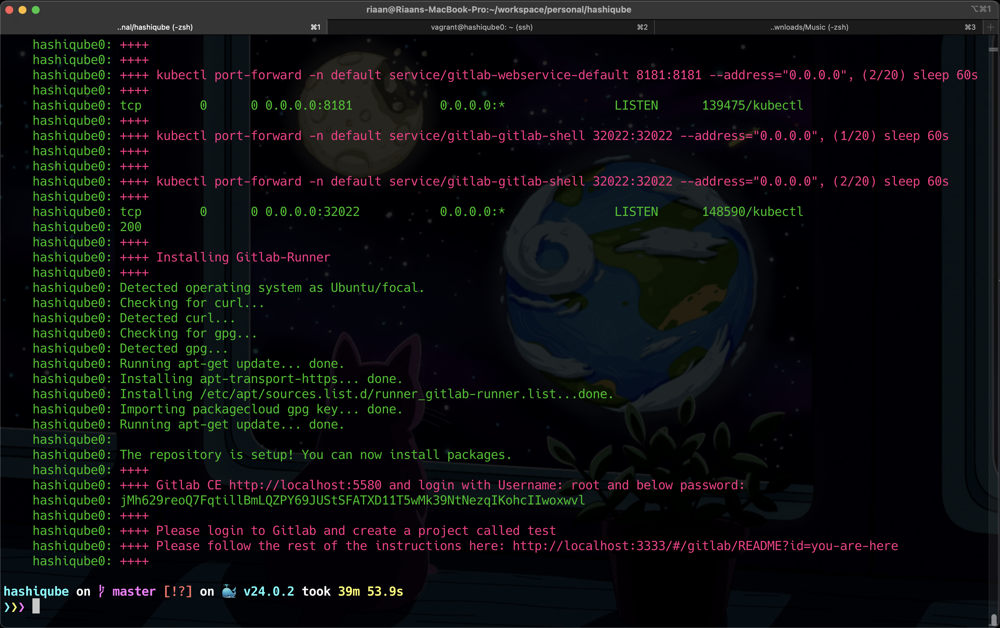
  <p><em>Terminal output during GitLab provisioning</em></p>
</div>

## 🔑 Accessing GitLab

Once installation is complete, you can access GitLab at:

- **URL**: [http://localhost:5580](http://localhost:5580)
- **Username**: `root`
- **Password**: The password is printed in the terminal output
  - Example: `jMh629reoQ7FqtillBmLQZPY69JUStSFATXD11T5wMk39NtNezqIKohcIIwoxwvl`

<div align="center">
  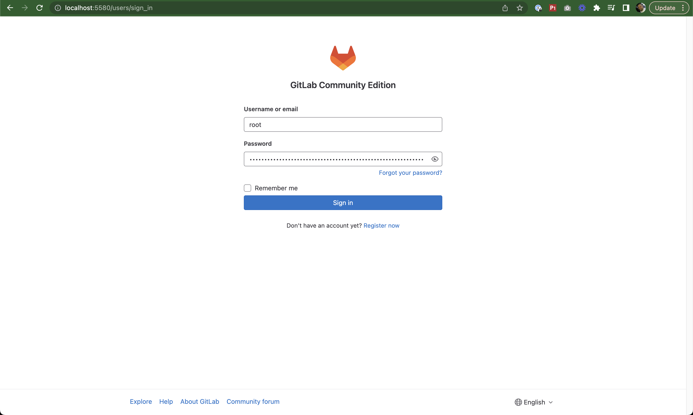
  <p><em>GitLab login page</em></p>
</div>

After logging in, you'll see the GitLab dashboard:

<div align="center">
  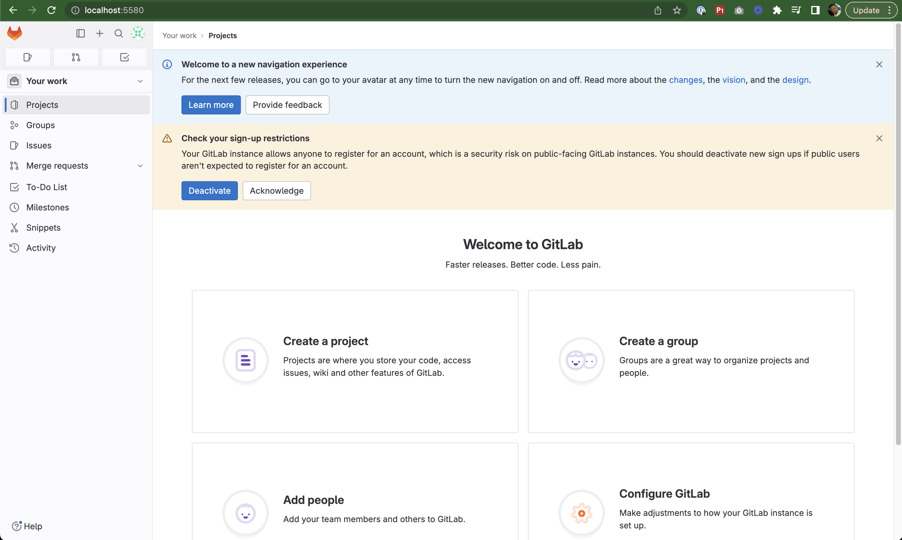
  <p><em>GitLab dashboard after first login</em></p>
</div>

## 🛠️ Hands-On Tutorial

### Creating Your First Project

1. Click on **Create a Project** → **Create a Blank project**
2. Enter the project name as `test`
3. Select the namespace as `root`
4. Make it a Public repository
5. Click **Create Project**

<div align="center">
  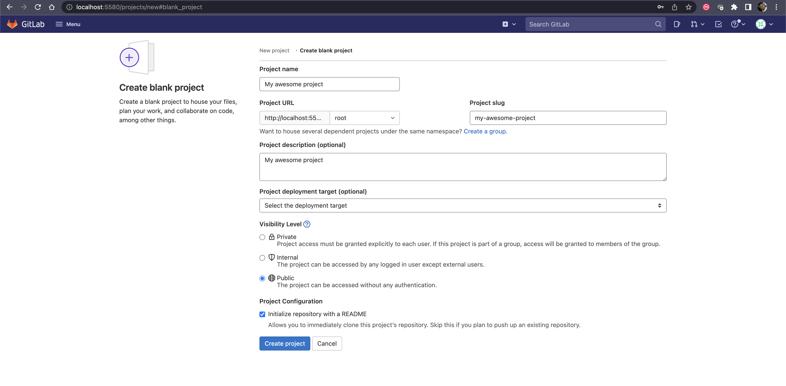
  <p><em>Creating a new project in GitLab</em></p>
</div>

Once created, you'll see your new repository:

<div align="center">
  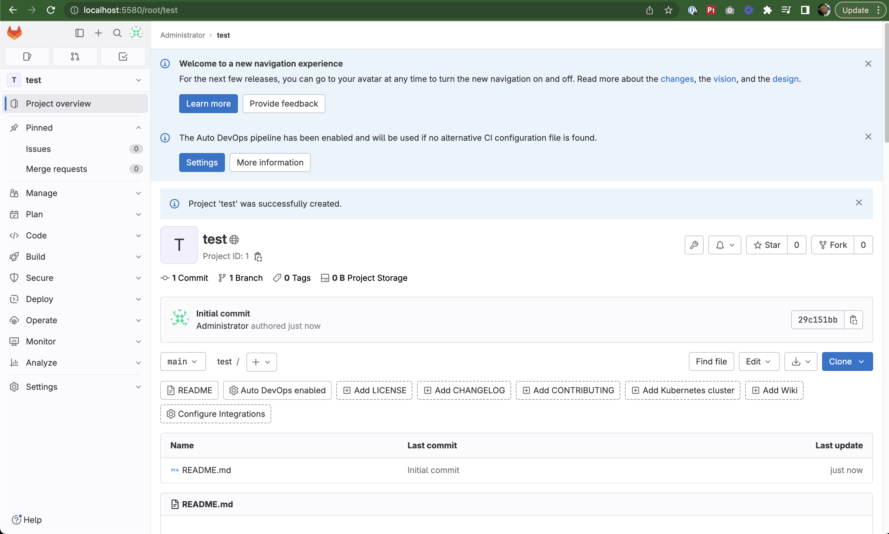
  <p><em>Newly created test project</em></p>
</div>

### Adding SSH Keys

To clone the repository using SSH, you need to add your SSH key to GitLab:

1. Click on your profile icon in the top left corner
2. Select **Preferences**

<div align="center">
  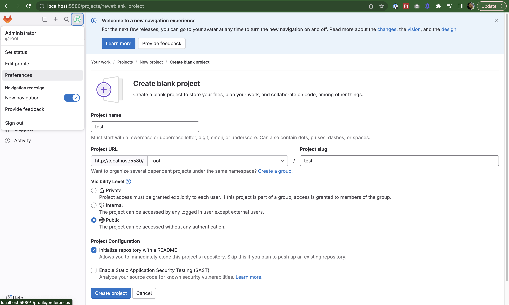
  <p><em>Navigating to user preferences</em></p>
</div>

3. Navigate to **SSH Keys** in the sidebar

<div align="center">
  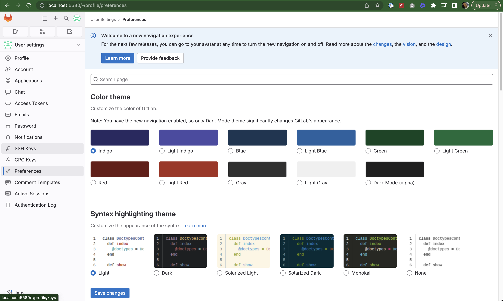
  <p><em>SSH Keys section in user preferences</em></p>
</div>

4. On your local machine, retrieve your public SSH key:

   ```bash
   cat ~/.ssh/id_rsa.pub
   ```

5. Copy the key and paste it into the GitLab SSH key field
6. **Important**: Remove the expiry date
7. Click **Add Key**

<div align="center">
  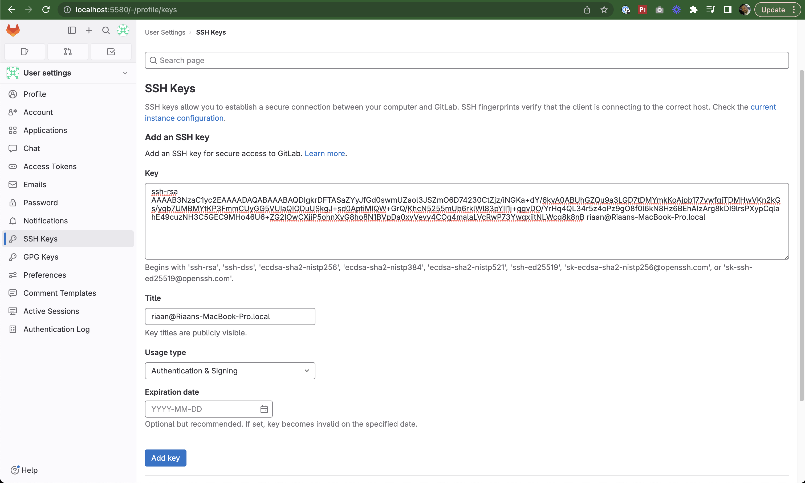
  <p><em>Adding an SSH key to your GitLab account</em></p>
</div>

After adding the key:

<div align="center">
  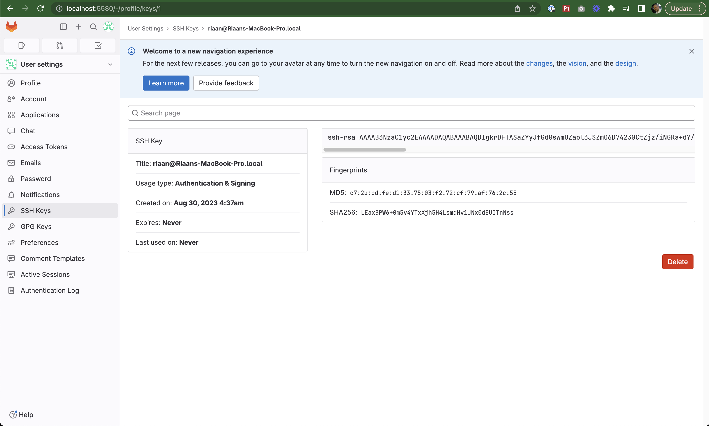
  <p><em>SSH key successfully added</em></p>
</div>

### Cloning Your Repository

1. Navigate back to your test project
2. Click the **Clone** button
3. Copy the **Clone with SSH** URL
   > ⚠️ **Note**: The HTTP link doesn't work correctly due to a bug with the port configuration. Use SSH instead.

<div align="center">
  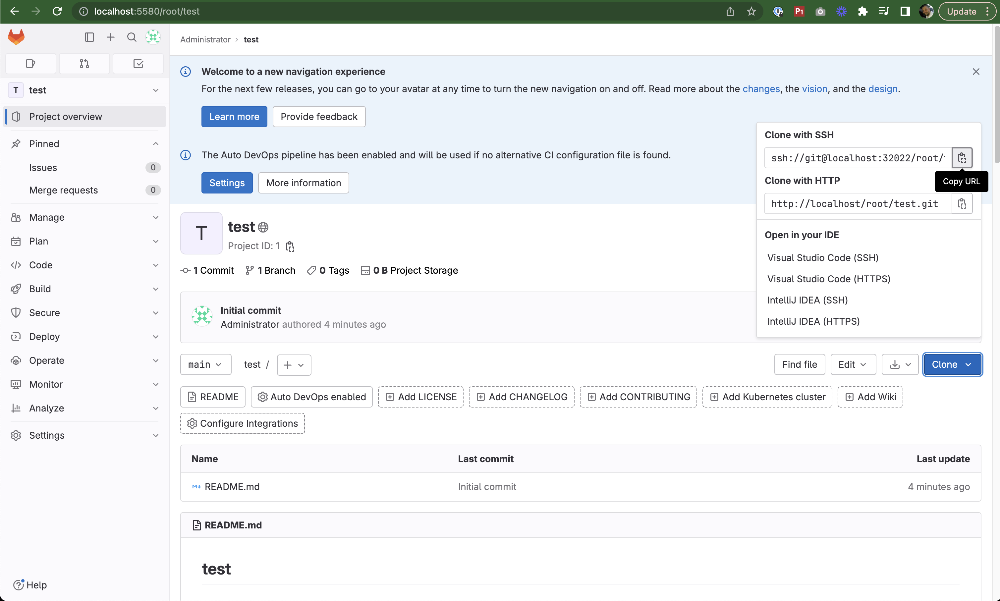
  <p><em>Copying the SSH clone URL</em></p>
</div>

4. Clone the repository:

   ```bash
   git clone ssh://git@localhost:32022/root/test.git
   ```

<div align="center">
  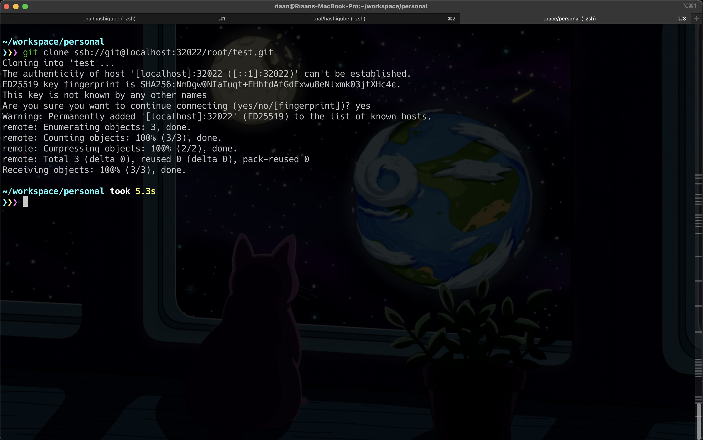
  <p><em>Successfully cloning the repository</em></p>
</div>

### Creating a GitLab CI Pipeline

1. In your local repository, create a `.gitlab-ci.yml` file:

   ```bash
   cd test
   nano .gitlab-ci.yml
   ```

2. Add the following pipeline configuration:

   ```yaml
   variables:
     REPOSITORY_URL: xxxxxxxxxxxxx.dkr.ecr.eu-west-1.amazonaws.com/container

   stages:
     - test
     - build
     - dev
     - stg
     - prd

   test:
     stage: test
     script:
       - echo 'Here you can run tests'

   build:
     stage: build
     script:
       - echo 'After Test stage was successful, here you can run build your container'

   dev:
     stage: dev
     script:
       - echo 'After Build stage was successful, here you can run your Development environment deployment'

   stg:
     stage: stg
     script:
       - echo 'After Dev stage was successful, here you can run your Staging environment deployment'

   prd:
     stage: prd
     script:
       - echo 'After Stg stage was successful, here you can run your Production environment deployment'
   ```

3. Commit and push the changes:

   ```bash
   git add .gitlab-ci.yml
   git commit -am "adding .gitlab-ci.yml pipeline file"
   git push
   ```

<div align="center">
  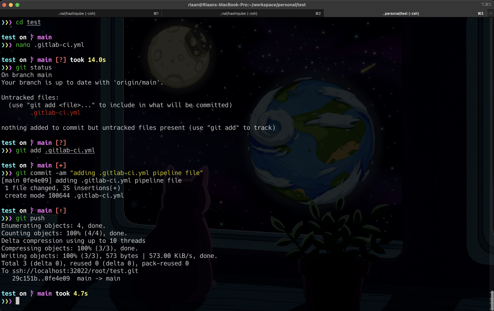
  <p><em>Adding a CI pipeline file to the repository</em></p>
</div>

After pushing, you'll see the file in your repository:

<div align="center">
  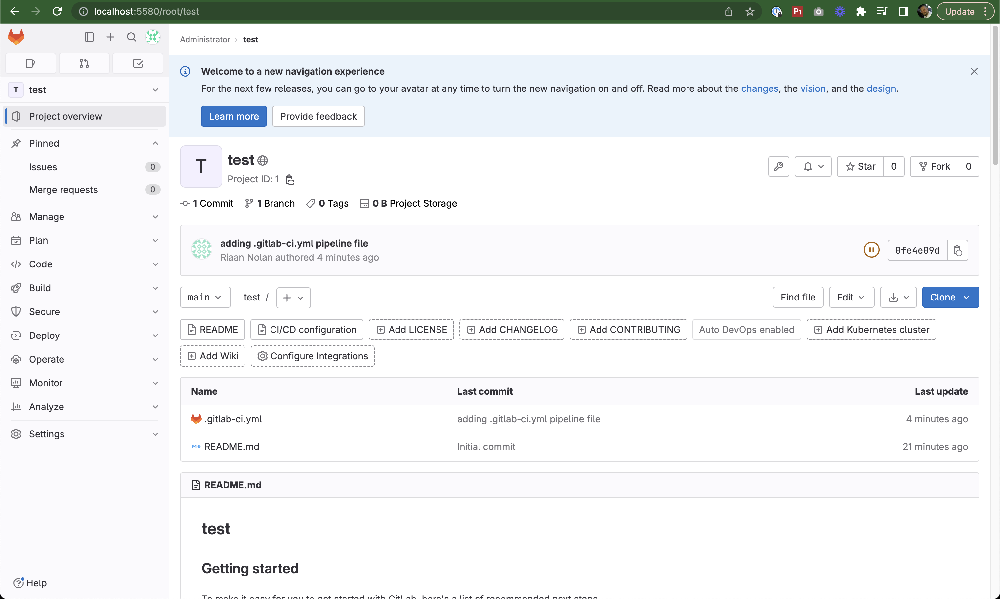
  <p><em>Pipeline file added to the repository</em></p>
</div>

### Setting Up a GitLab Runner

1. In your project, navigate to **Settings** → **CI/CD**

<div align="center">
  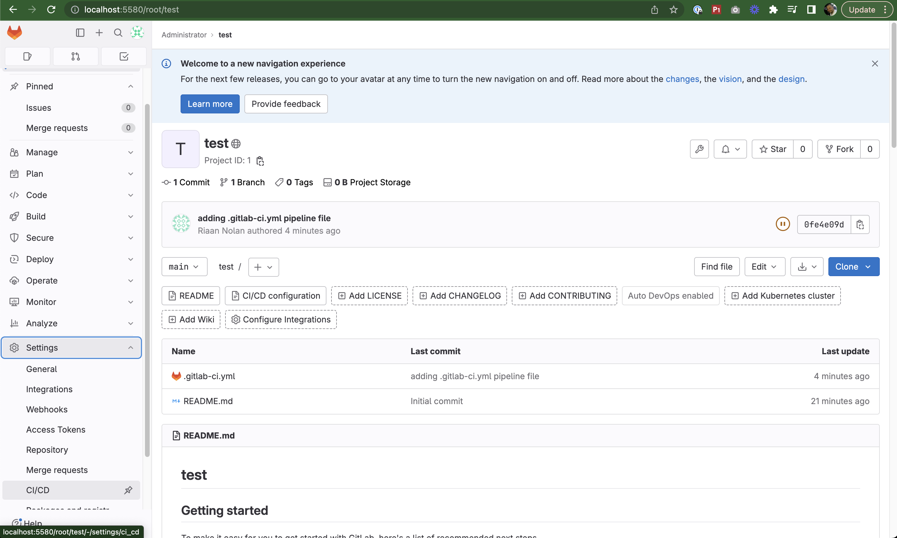
  <p><em>Navigating to CI/CD settings</em></p>
</div>

2. Expand the **Runners** section

<div align="center">
  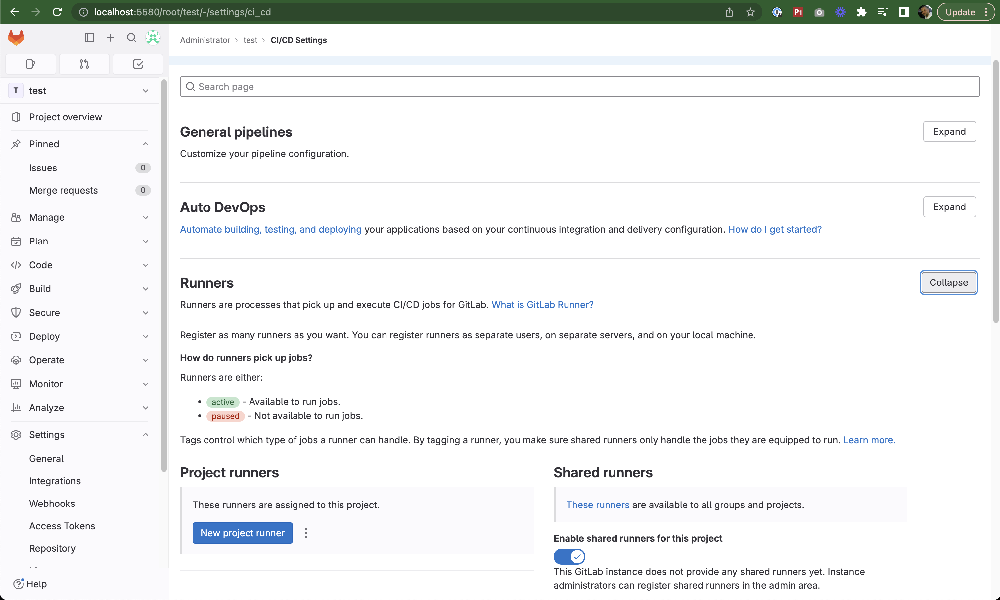
  <p><em>Expanding the Runners section</em></p>
</div>

3. Click **New Project Runner**
4. In the configuration form, check **Run Untagged Jobs**
5. Click **Create Runner**

<div align="center">
  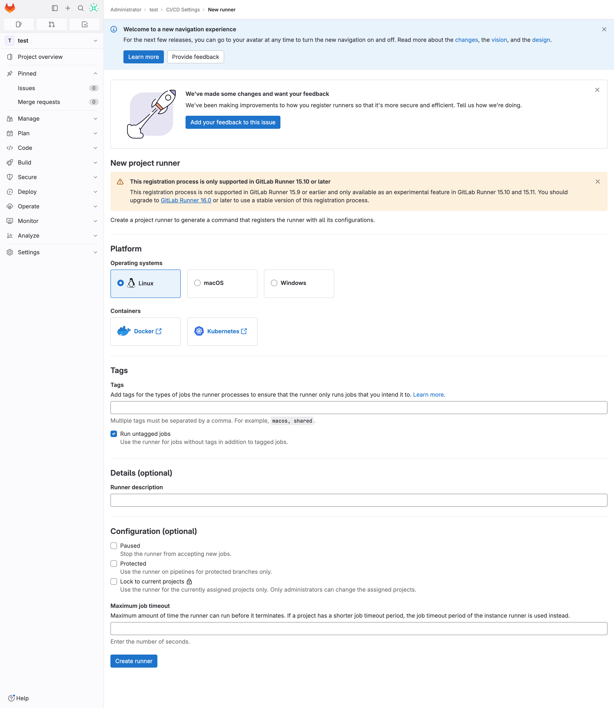
  <p><em>Creating a new project runner</em></p>
</div>

> ⚠️ **Note**: Due to a known bug, you might be redirected to a blank page. If this happens, manually add `:5580` to the URL:
>
> **Instead of**: <http://localhost/root/test/-/runners/1/register?platform=linux>  
> **Use**: <http://localhost:5580/root/test/-/runners/1/register?platform=linux>

<div align="center">
  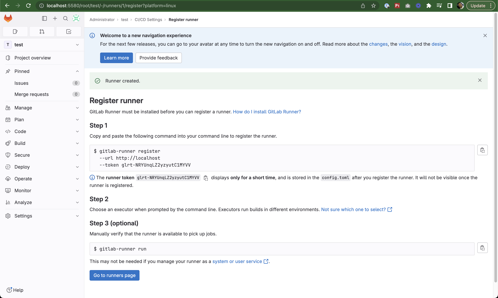
  <p><em>Runner registration page</em></p>
</div>

### Registering the Runner

1. Copy the registration command, but remember to add the port `:5580`:

   **Incorrect**:

   ```
   gitlab-runner register --url http://localhost --token glrt-NRYUnqLZ2yzyutC1MYVV
   ```

   **Correct**:

   ```
   gitlab-runner register --url http://localhost:5580 --token glrt-NRYUnqLZ2yzyutC1MYVV
   ```

2. SSH into your HashiQube instance:

   ```bash
   vagrant ssh
   ```

<div align="center">
  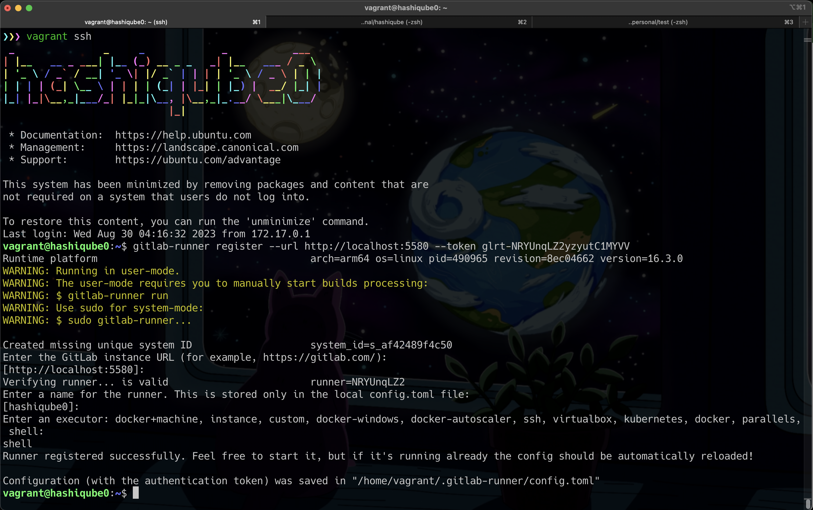
  <p><em>SSHing into HashiQube to register the runner</em></p>
</div>

3. Register the runner with the corrected command
4. Start the runner:

   ```bash
   gitlab-runner run
   ```

<div align="center">
  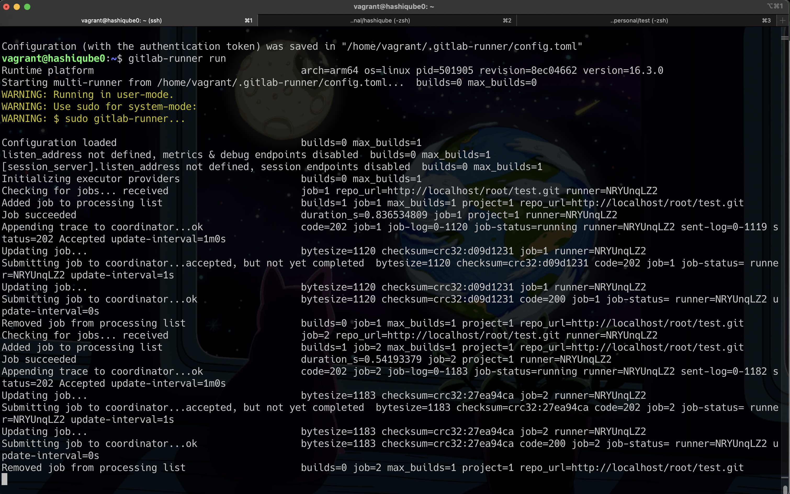
  <p><em>Starting the GitLab runner</em></p>
</div>

5. Return to GitLab to see the confirmation:

<div align="center">
  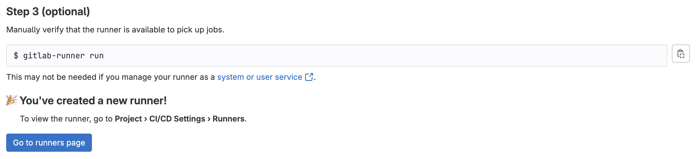
  <p><em>Runner successfully registered</em></p>
</div>

6. Click **Go to the Runners page** to see your registered runner:

<div align="center">
  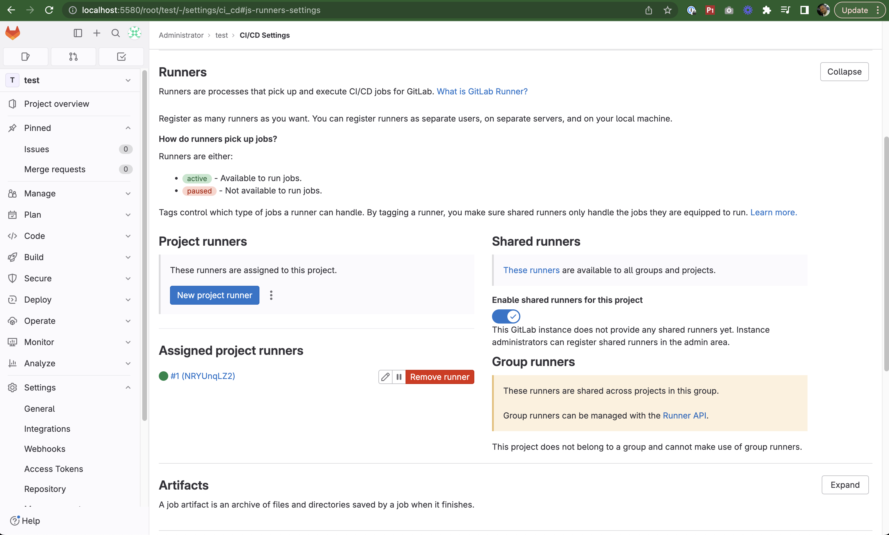
  <p><em>Runners page showing the registered runner</em></p>
</div>

### Running Your Pipeline

1. Navigate to **Build** → **Pipelines** in the left sidebar

<div align="center">
  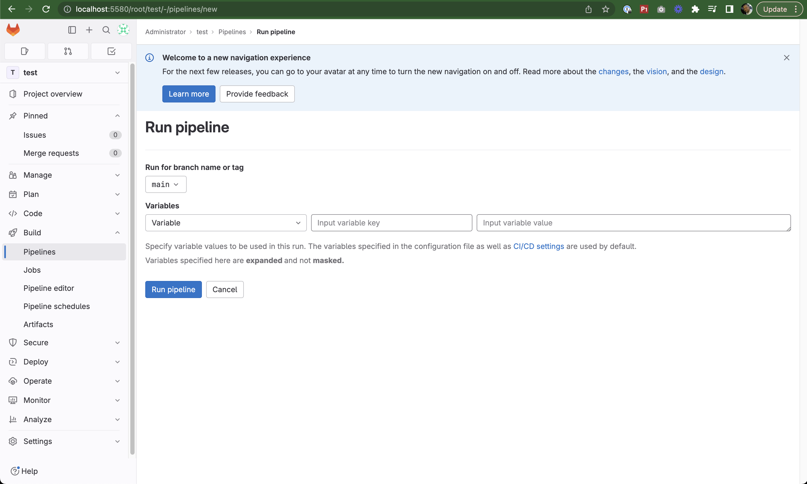
  <p><em>Pipelines section</em></p>
</div>

2. You'll see your pipeline is running:

<div align="center">
  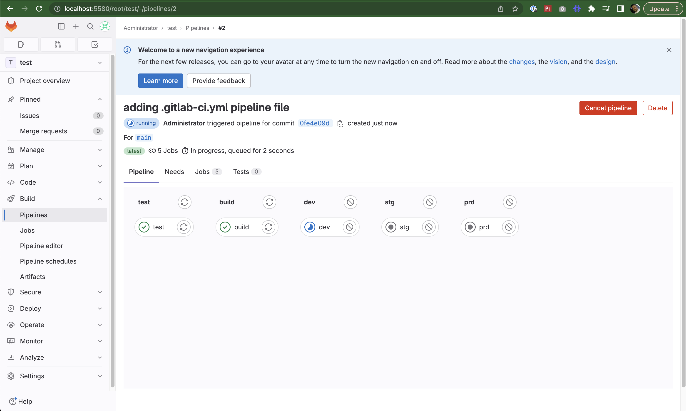
  <p><em>Pipeline running in progress</em></p>
</div>

3. To see job details, navigate to **Jobs** in the left sidebar and click on a job:

<div align="center">
  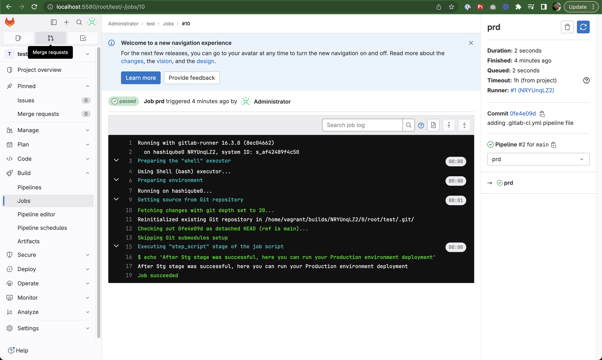
  <p><em>Job details showing execution results</em></p>
</div>

## 📚 Additional Resources

- [GitLab Documentation](https://docs.gitlab.com/)
- [GitLab Runner Documentation](https://docs.gitlab.com/runner/)
- [GitLab with Docker](https://docs.gitlab.com/omnibus/docker/)
- [GitLab CI/CD Pipeline Configuration](https://docs.gitlab.com/ee/ci/yaml/)

## 🔧 GitLab Provisioner Script

The GitLab environment is set up using this script:

[filename](gitlab.sh ':include :type=code')

[google ads](../googleads.html ':include :type=iframe width=100% height=300px')