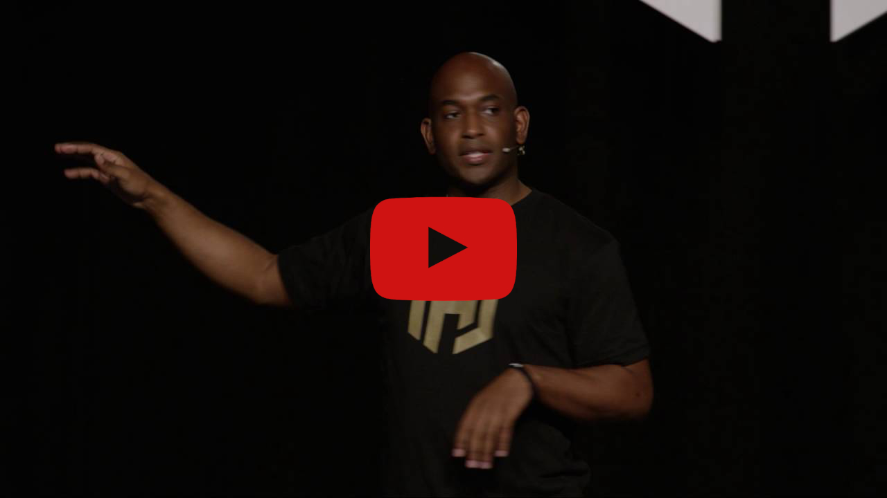

# HashiCorp

http://www.hashicorp.com

## About
HashiCorp delivers consistent workflows to provision, secure, connect, and run any infrastructure for any application.
HashiCorp was founded by Mitchell Hashimoto and Armon Dadgar in 2012 with the goal of revolutionizing datacenter management: application development, delivery, and maintenance. ... IaaS, PaaS, SaaS. ... Our tools manage both physical machines and virtual machines, Windows, and Linux, SaaS ...

## Latest News 

- [HashiCorp blog posts](https://www.hashicorp.com/blog/all)

## HashiStack
* [Terraform](/terraform/?id=terraform)
* [Terraform Cloud](/terraform/README?id=terraform-cloud)
* [Vault](/vault/?id=vault)
* [Consul](/consul/?id=consul)
* [Nomad](/hashicorp/?id=nomad)
* [Boundary](/nomad/?id=boundary)
* [Waypoint](/waypoint/?id=waypoint)
* [Vagrant](/vagrant/?id=vagrant)
* [Packer](/packer/?id=packer)
* [Brand Logo's](https://www.hashicorp.com/brand)
* [Cloud Operating Model](https://www.hashicorp.com/resources/deriving-business-value-from-the-cloud-operating-model-in-the-public-sector)

| Dimension | Products | | | 
|------|--------|------------|------------|
| __Applications__ |    [__Nomad__](/nomad/#nomad)   Schedular and workload orchestrator to deploy and manage applications |    [__Waypoint__](/waypoint/#waypoint)   One workflow to build, deploy and release applications across platforms| | 
| __Networking__ |    [__Consul__](/consul/#consul)   Service Mesh across any cloud and runtime platform | | |
| __Security__ |    [__Boundary__](/boundary/#boundary)   Secure remote access to applications and critical systems |    [__Vault__](/vault/#vault)   Secure management of secrets and sensitive data| |
| __Infrastructure__ |    [__Packer__](/packer/#packer)   Automated machine images from a single source configuration|    [__Vagrant__](/vagrant/#vagrant)   Single workflow to build and manage developer environments|    [__Terraform__](/terraform/#terraform)   Infrastructure automation to provision and manage any cloud service |

## Links 

* https://www.hashicorp.com/resources/deriving-business-value-from-the-cloud-operating-model-in-the-public-sector
* https://ir.hashicorp.com/node/6701/html
## 12-Factor Apps

Kelsey Hightower presenting 12-Factor Apps and the HashiStack
https://github.com/kelseyhightower/hashiapp

Five years ago the world was introduced to 12 Factor apps which provided the blueprint for building applications for the cloud. 

As we move beyond the cloud into Hyperscale computing applications must be designed to be globally available and always on. Building on the foundation of 12 Factor, this session will introduce key requirements for Hyperscale applications such as high performance low latency communication, and playing nice in a distributed system. Attendees will learn how to build Hyperscale applications from the ground up using the HashiStack (Nomad, Vault, and Consul).

Kelsey Hightower, Senior Developer Advocate at Google

12-Factor Apps and the HashiStack

Five years ago the world was introduced to 12 Factor apps which provided the blueprint for building applications for the cloud. As we move beyond the cloud into Hyperscale computing applications must be designed to be globally available and always on. Building on the foundation of 12 Factor, this session will introduce key requirements for Hyperscale applications such as high performance low latency communication, and playing nice in a distributed system. Attendees will learn how to build Hyperscale applications from the ground up using the HashiStack (Nomad, Vault, and Consul).

