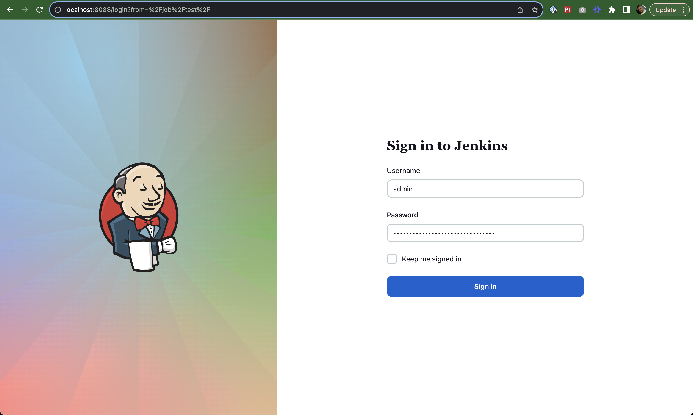
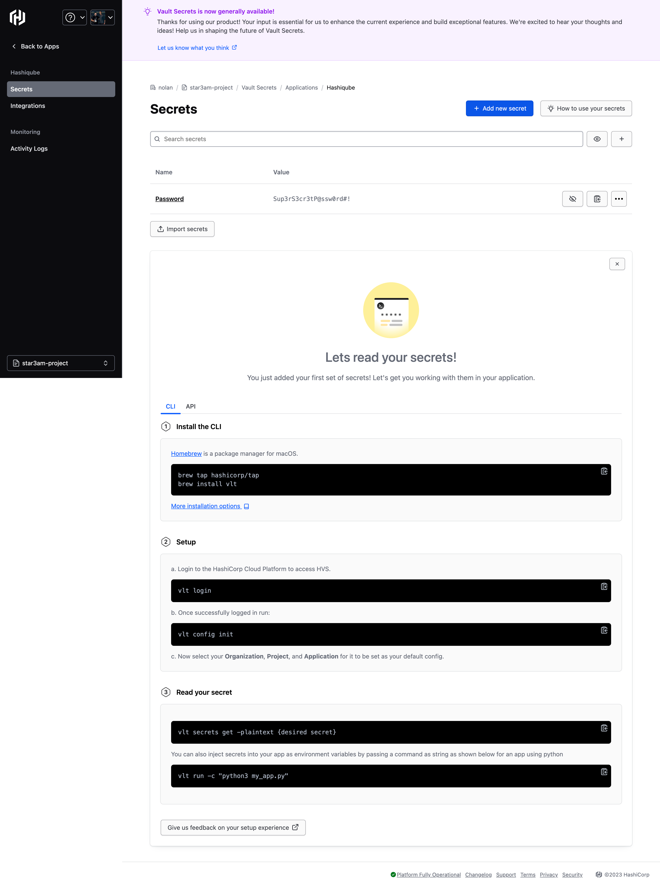
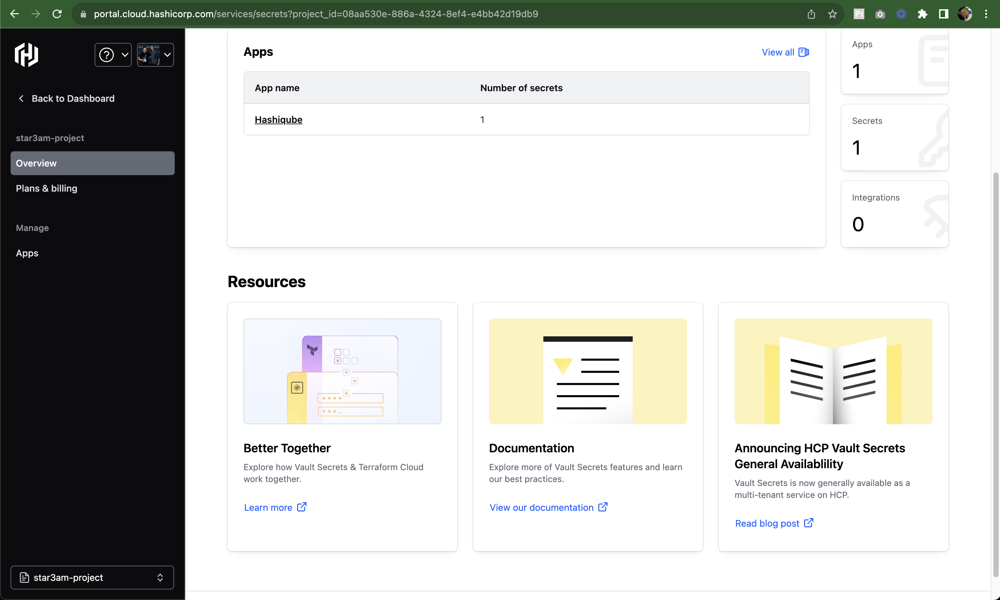
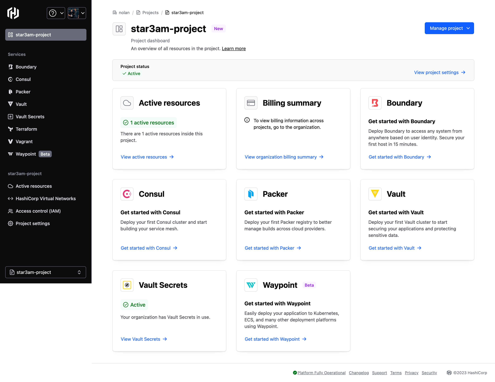
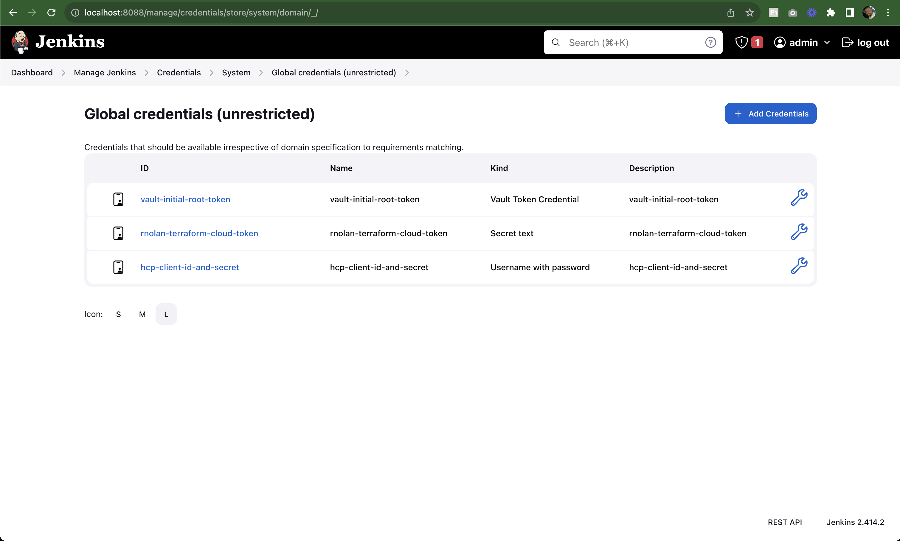
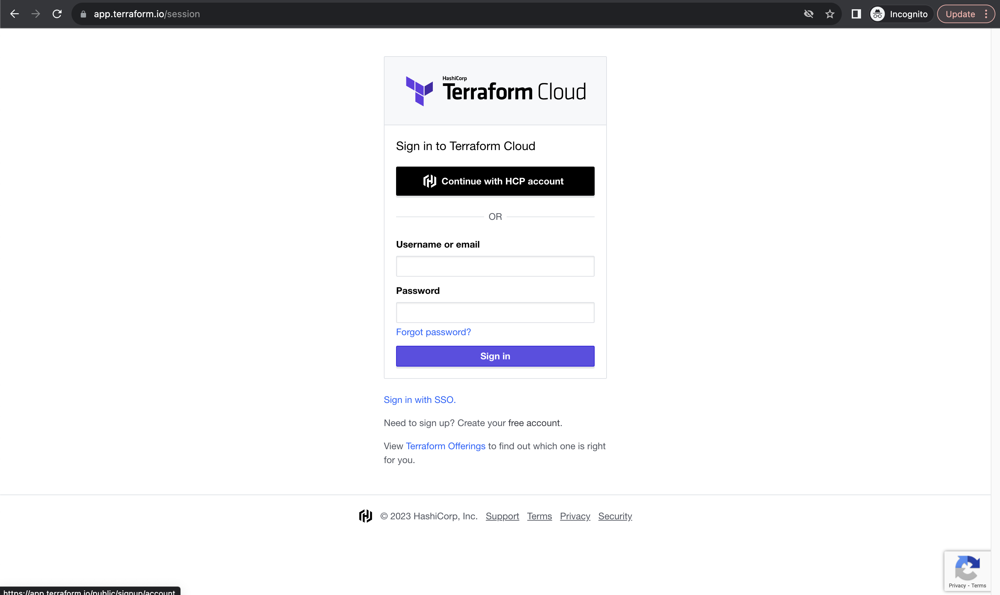
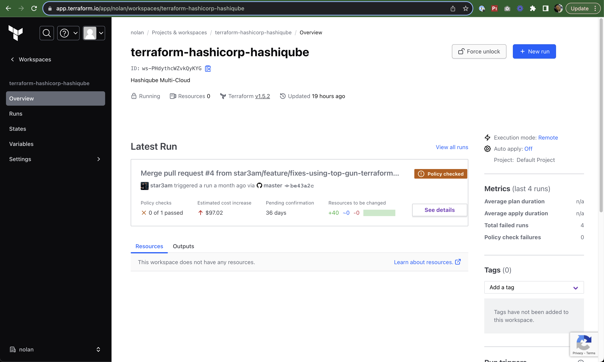
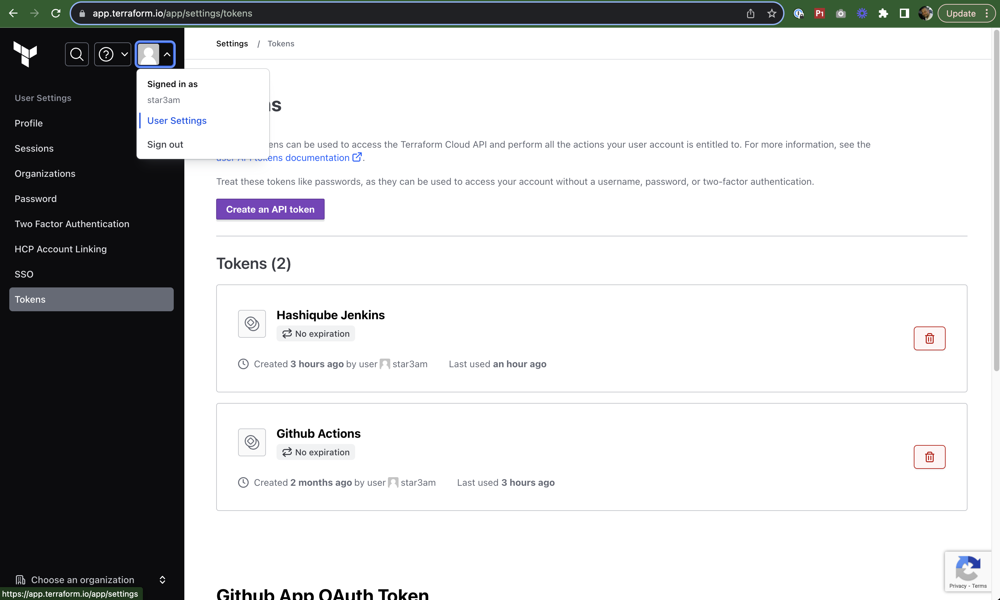
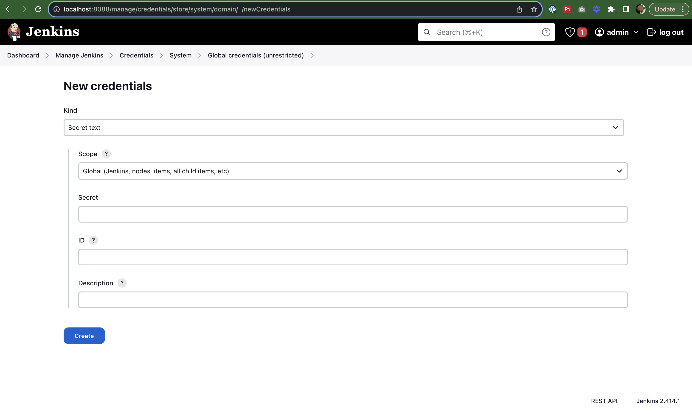
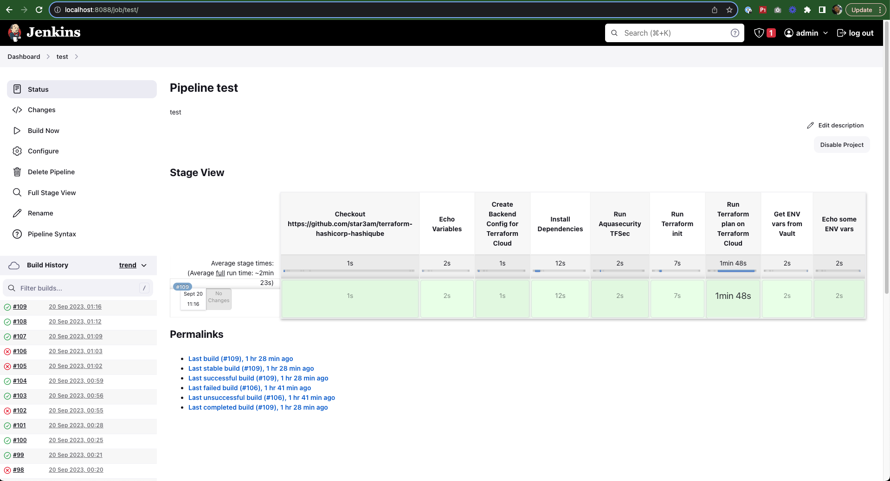

# Jenkins

<div align="center">
  
  <br><br>
  <p><strong>Open source automation server for building, testing, and deploying your applications</strong></p>
</div>

## 🚀 About

In this HashiQube DevOps lab, you'll get hands-on experience with Jenkins, an open source automation server that helps automate software development processes including building, testing, and deployment, facilitating continuous integration and continuous delivery.

This lab demonstrates a practical example of a Jenkins pipeline that:

- Retrieves secrets from HashiCorp Vault in HashiQube
- Retrieves secrets from HCP Vault Secrets (HashiCorp Cloud Platform)
- Uses CLI integration with Terraform Cloud to run a plan on a workspace

## 📋 Provision

<!-- tabs:start -->

### **Github Codespace**

[](https://codespaces.new/star3am/hashiqube?quickstart=1)

```bash
bash docker/docker.sh
bash vault/vault.sh
bash jenkins/jenkins.sh
```

### **Vagrant**

```bash
vagrant up --provision-with basetools,docker,docsify,vault,jenkins
```

### **Docker Compose**

```bash
docker compose exec hashiqube /bin/bash
bash hashiqube/basetools.sh
bash docker/docker.sh
bash docsify/docsify.sh
bash vault/vault.sh
bash jenkins/jenkins.sh
```

<!-- tabs:end -->

## 🔑 Initial Login

Once Jenkins is provisioned, you'll receive an initial admin token in the output:

```bash
Login with 4ed0dc30230c4310a58a22207414c3aa
```

Use this token to log in to Jenkins:

<div align="center">
  
  <p><em>Initial login screen requiring the admin token</em></p>
</div>

<div align="center">
  
  <p><em>Jenkins dashboard after successful login</em></p>
</div>

## 🔌 Installing Plugins

### Step 1: Install Suggested Plugins

When prompted, select "Install suggested plugins" to get started with the basic set of plugins:

<div align="center">
  
  <p><em>Installing the suggested plugins</em></p>
</div>

The installation process will begin:

<div align="center">
  
  <p><em>Plugin installation in progress</em></p>
</div>

### Step 2: Create Admin User

Create your first admin user with your preferred credentials:

<div align="center">
  
  <p><em>Creating the first administrator account</em></p>
</div>

### Step 3: Complete Initial Setup

Click "Save and Finish" to complete the initial instance configuration:

<div align="center">
  
  <p><em>Setting up the Jenkins URL</em></p>
</div>

Click "Start using Jenkins" to proceed to the dashboard:

<div align="center">
  
  <p><em>Ready to start using Jenkins</em></p>
</div>

### Step 4: Install Additional Plugins

We need to install some additional plugins for our HashiCorp integration:

1. Navigate to "Manage Jenkins" → "Manage Plugins"

<div align="center">
  
  <p><em>Accessing the plugin manager</em></p>
</div>

2. Click on "Available" tab and search for:
   - "HashiCorp Vault"
   - "Pipeline: Multibranch with defaults"

3. Select these plugins and click "Download and Install after Restart"

4. Select "Restart Jenkins once Installation is Complete"

<div align="center">
  
  <p><em>Restarting Jenkins after installing new plugins</em></p>
</div>

5. Click "Enable Automatic Refresh" in the top right to be redirected to the login page
6. Log in with the admin credentials you created earlier

## 🔐 Configuring HashiCorp Vault

> **Note**: The Vault setup was automatically done for you during the provisioning step with the command in `jenkins/jenkins.sh`.

### Verifying Vault is Running

Make sure Vault is running and unsealed:

1. Open [http://localhost:8200](http://localhost:8200)
2. Use the unseal keys and root token provided during provisioning
3. After logging in, you should see the Vault dashboard:

<div align="center">
  
  <p><em>Vault UI after successful login</em></p>
</div>

### Setting Up Secret Engines

To prepare Vault for our Jenkins integration, we need to enable KV secret engines (v1 and v2) and add some test data:

1. Click on "Enable new engine +" (top right)

<div align="center">
  
  <p><em>Enabling the KV secrets engine</em></p>
</div>

2. Select KV and set the path to "kv2" for version 2:

<div align="center">
  
  <p><em>Configuring the KV v2 secret engine</em></p>
</div>

3. Add a secret at path `secret/another_test` with the key `another_test`:

<div align="center">
  
  <p><em>Adding a secret to the KV v2 engine</em></p>
</div>

4. Enable KV v1 at the path "kv1":

<div align="center">
  
  <p><em>Enabling the KV v1 secret engine</em></p>
</div>

5. Add secrets to the KV v1 engine:
   - Path: `secret/testing`
   - Keys: `value_one` and `value_two` with values of your choice

<div align="center">
  
  <p><em>Adding secrets to the KV v1 engine</em></p>
</div>

### Connecting Jenkins to Vault

Configure Jenkins to access Vault:

1. Navigate to "Manage Jenkins" → "Configure System"
2. Scroll down to the Vault section

<div align="center">
  
  <p><em>Configuring Vault integration in Jenkins</em></p>
</div>

3. Set the Vault address to `http://10.9.99.10:8200`
4. Check "Skip SSL Validation" for this demo
5. Add the Vault root token as the credential:

<div align="center">
  
  <p><em>Adding the Vault root token to Jenkins</em></p>
</div>

## ☁️ HCP Vault Secrets Integration

[HashiCorp Cloud Platform (HCP) Vault Secrets](https://portal.cloud.hashicorp.com/) is a cloud-based secrets management service that centralizes secrets while syncing them to platforms like CSPs, GitHub, and Vercel.

### Setting Up HCP Vault Secrets

1. Register an organization on [HashiCorp Cloud Portal](https://portal.cloud.hashicorp.com/)
2. Navigate to Vault Secrets

<div align="center">
  
  <p><em>HCP Vault Secrets application setup</em></p>
</div>

3. Create your first secret:

<div align="center">
  
  <p><em>Creating a secret in HCP Vault Secrets</em></p>
</div>

4. Create a project:

<div align="center">
  
  <p><em>HCP dashboard with projects</em></p>
</div>

5. Note the following information for your Jenkins pipeline:
   - `YOUR_HCP_CLIENT_ID`
   - `YOUR_HCP_CLIENT_SECRET`
   - `YOUR_HCP_ORGANIZATION_NAME`
   - `YOUR_HCP_PROJECT_NAME`
   - `YOUR_HCP_APP_NAME`

6. Set up credentials in Jenkins:

<div align="center">
  
  <p><em>Adding HCP credentials to Jenkins</em></p>
</div>

When you run the pipeline, your secret will be fetched from HCP Vault Secrets (and will be masked in the output):

<div align="center">
  
  <p><em>Jenkins pipeline accessing HCP Vault Secrets</em></p>
</div>

## ☁️ Terraform Cloud Integration

### Setting Up Terraform Cloud

1. Sign up for a free [Terraform Cloud account](https://app.terraform.io/) (no credit card required):

<div align="center">
  
  <p><em>Signing up for a Terraform Cloud account</em></p>
</div>

2. Create a workspace (e.g., `terraform-hashicorp-hashiqube`):

<div align="center">
  
  <p><em>Creating a Terraform Cloud workspace</em></p>
</div>

3. Generate a Terraform Cloud token for API access:

<div align="center">
  
  <p><em>Generating a Terraform Cloud API token</em></p>
</div>

### Adding Terraform Cloud Token

Add your Terraform Cloud token as a "Secret Text" credential in Jenkins:

<div align="center">
  
  <p><em>Adding a Secret Text credential to Jenkins</em></p>
</div>

## 📝 Creating a Jenkins Pipeline

Now let's create a Jenkins pipeline that demonstrates integration with Vault and Terraform Cloud:

1. In Jenkins, click on "New Item" → "Pipeline" and give it a name (e.g., `vault-jenkins`)
2. In the pipeline definition section, add the following Jenkinsfile code, replacing the placeholders with your values:

```groovy
// https://github.com/jenkinsci/hashicorp-vault-plugin
// https://www.jenkins.io/doc/book/pipeline/jenkinsfile/

import hudson.model.Job
import jenkins.scm.api.mixin.ChangeRequestSCMHead
import jenkins.scm.api.mixin.TagSCMHead
import org.jenkinsci.plugins.workflow.multibranch.BranchJobProperty

node {
  properties([disableConcurrentBuilds()])

  stage('Checkout https://github.com/star3am/terraform-hashicorp-hashiqube') {
    sh """
      git config --global --add safe.directory "${env.WORKSPACE}"
    """
    git(
      url: "https://github.com/star3am/terraform-hashicorp-hashiqube.git",
      branch: "master",
      changelog: true,
      poll: true
    )
  }

  stage('Echo Variables') {
    echo "JOB_NAME: ${env.JOB_NAME}"
    echo "BUILD_ID: ${env.BUILD_ID}"
    echo "BUILD_NUMBER: ${env.BUILD_NUMBER}"
    echo "BRANCH_NAME: ${env.BRANCH_NAME}"
    echo "PULL_REQUEST: ${env.CHANGE_ID}"
    echo "BUILD_NUMBER: ${env.BUILD_NUMBER}"
    echo "BUILD_URL: ${env.BUILD_URL}"
    echo "NODE_NAME: ${env.NODE_NAME}"
    echo "BUILD_TAG: ${env.BUILD_TAG}"
    echo "JENKINS_URL: ${env.JENKINS_URL}"
    echo "EXECUTOR_NUMBER: ${env.EXECUTOR_NUMBER}"
    echo "WORKSPACE: ${env.WORKSPACE}"
    echo "GIT_COMMIT: ${env.GIT_COMMIT}"
    echo "GIT_URL: ${env.GIT_URL}"
    echo "GIT_BRANCH: ${env.GIT_BRANCH}"
    LAST_COMMIT_MSG = sh(returnStdout: true, script: "git log -n 1 --pretty=format:'%s'")
    echo "LAST_COMMIT_MSG: ${LAST_COMMIT_MSG}"
    env.ARCH = sh(returnStdout: true, script: "lscpu | grep 'Architecture' | tr -s ' ' | cut -d ' ' -f 2 | tr -d '[:space:]'")
    echo "ARCH: ${env.ARCH}"
    env.PATH = "${env.PATH}:${env.WORKSPACE}/bin"
    env.TF_CLI_ARGS = "-no-color"
    echo sh(script: 'env|sort', returnStdout: true)
    sh('echo $(hostname)')
  }

  stage('Create Backend Config for Terraform Cloud') {
    withCredentials([string(credentialsId: 'YOUR_CREDENTIALS_ID', variable: 'SECRET')]) {
      sh """
        cat <<EOF | tee backend.tf
terraform {
  cloud {
    organization = "YOUR_TF_CLOUD_ORGANIZATION"
    workspaces {
      name = "YOUR_TF_WORKSPACE"
    }
    token = "${SECRET}"
  }
}
EOF
      """
    }
  }

  stage('Install Dependencies') {
    sh """
      pwd
      mkdir -p bin
    """
    if (env.ARCH == "x86_64*") {
      script {
        env.arch = "amd64"
        echo "${env.arch}"
      }
    }
    if (env.ARCH == 'aarch64') {
      script {
        env.arch = "arm64"
        echo "${env.arch}"
      }
    }
    sh """
      curl -s "https://releases.hashicorp.com/terraform/1.5.7/terraform_1.5.7_linux_${env.arch}.zip" --output bin/terraform.zip
      (cd bin && unzip -o terraform.zip && cd ${env.WORKSPACE})
      curl -Lso bin/tfsec "https://github.com/aquasecurity/tfsec/releases/download/v1.28.4/tfsec-linux-${env.arch}"
      chmod +x bin/tfsec
      curl -s "https://releases.hashicorp.com/vlt/1.0.0/vlt_1.0.0_linux_${env.arch}.zip" --output bin/vlt.zip
      (cd bin && unzip -o vlt.zip && cd ${env.WORKSPACE})
      pwd
      ls -la
      ls -la bin/
      terraform -v
      tfsec -v
      vlt -v
      echo "${env.arch}"
      echo "${env.PATH}"
    """
  }

  stage('Run Aquasecurity TFSec') {
    sh('tfsec ./modules --no-color --soft-fail')
  }

  stage('Run Terraform init') {
    sh('terraform init')
  }

  stage('Run Terraform plan on Terraform Cloud') {
    sh('terraform plan')
  }

  // https://developer.hashicorp.com/hcp/docs/vault-secrets/commands/config
  // https://developer.hashicorp.com/vault/tutorials/hcp-vault-secrets-get-started/hcp-vault-secrets-retrieve-secret
  stage('Get Secret from HCP Vault Secrets') {
    withCredentials([usernamePassword(credentialsId: 'YOUR_CREDENTIALS_ID', usernameVariable: 'HCP_CLIENT_ID', passwordVariable: 'HCP_CLIENT_SECRET')]) {
      sh """
        HCP_CLIENT_ID=${HCP_CLIENT_ID} HCP_CLIENT_SECRET=${HCP_CLIENT_SECRET} vlt login
        vlt secrets list --organization YOUR_HCP_ORGANIZATION_NAME --project YOUR_HCP_PROJECT_NAME --app-name YOUR_HCP_APP_NAME
        vlt secrets get --organization YOUR_HCP_ORGANIZATION_NAME --project YOUR_HCP_PROJECT_NAME --app-name YOUR_HCP_APP_NAME Password
      """
    }
  }

  stage('Get ENV vars from Vault') {
    // define the secrets and the env variables
    // engine version can be defined on secret, job, folder or global.
    // the default is engine version 2 unless otherwise specified globally.
    def secrets = [
      [path: 'kv2/secret/another_test', engineVersion: 2, secretValues: [
      [vaultKey: 'another_test']]],
      [path: 'kv1/secret/testing/value_one', engineVersion: 1, secretValues: [
      [vaultKey: 'value_one']]],
      [path: 'kv1/secret/testing/value_two', engineVersion: 1, secretValues: [
      [envVar: 'my_var', vaultKey: 'value_two']]]
    ]

    // optional configuration, if you do not provide this the next higher configuration
    // (e.g. folder or global) will be used
    def configuration = [vaultUrl: 'http://10.9.99.10:8200',
      vaultCredentialId: 'vault-initial-root-token',
      engineVersion: 1]

    // inside this block your credentials will be available as env variables
    withVault([configuration: configuration, vaultSecrets: secrets]) {
      sh 'echo $value_one'
      sh 'echo $my_var'
      sh 'echo $another_test'
    }
  }

  stage('Echo some ENV vars') {
    withCredentials([[$class: 'VaultTokenCredentialBinding', credentialsId: 'vault-initial-root-token', vaultAddr: 'http://10.9.99.10:8200']]) {
      // values will be masked
      sh 'echo TOKEN=$VAULT_TOKEN'
      sh 'echo ADDR=$VAULT_ADDR'
    }
    echo sh(script: 'env|sort', returnStdout: true)
  }
}
```

<div align="center">
  
  <p><em>Configuring the Jenkins pipeline</em></p>
</div>

3. Click "Save" to save your pipeline configuration

## ▶️ Running the Pipeline

Click on "Build Now" in the left menu to run your pipeline:

<div align="center">
  
  <p><em>Pipeline build in progress</em></p>
</div>

View the console output to see the detailed execution:

<div align="center">
  
  <p><em>Pipeline console output showing secret retrieval</em></p>
</div>

The Jenkins console log will show that:

- The GitHub repository is cloned
- Aquasec's TFSec scans the code for security issues
- Terraform runs a plan on Terraform Cloud
- Secrets are fetched from both local Vault and HCP Vault Secrets (masked in the output)

## 🧩 Pipeline Components

The pipeline demonstrates several key integrations:

1. **HashiCorp Vault Integration** - Secure retrieval of secrets from Vault KV v1 and v2 engines
2. **HCP Vault Secrets** - Cloud-based secrets management
3. **Terraform Cloud** - Remote Terraform plan and apply execution
4. **Security Scanning** - TFSec for Terraform security scanning
5. **Environment Variables** - Secure handling of sensitive credentials

## 🔧 Provisioner Script

The Jenkins environment is set up using this script:

```bash
#!/bin/bash

# Print the commands that are run
set -x

# Stop execution if something fails
set -e

# This script provisions Jenkins

# Check if Hashicorp Vault is running
echo -e '\e[38;5;198m'"++++ "
echo -e '\e[38;5;198m'"++++ Check if Hashicorp Vault is running"
echo -e '\e[38;5;198m'"++++ "
if pgrep -x "vault" >/dev/null
then
echo "Vault is running"
else
echo -e '\e[38;5;198m'"++++ Ensure Vault is running.."
sudo bash /vagrant/vault/vault.sh
fi

# Check if jenkins exists
echo -e '\e[38;5;198m'"++++ "
echo -e '\e[38;5;198m'"++++ Check if jenkins is already provisioned"
echo -e '\e[38;5;198m'"++++ "
if [[ $(docker ps -a | grep jenkins) ]]; then
  echo "Jenkins already provisioned, skipping.."
else
  echo -e '\e[38;5;198m'"++++ "
  echo -e '\e[38;5;198m'"++++ Jenkins is being provisioned.."
  echo -e '\e[38;5;198m'"++++ "
  cd /vagrant/jenkins
  # Start Jenkins container, with port
  JENKINS_PORT=8088
  echo -e '\e[38;5;198m'"++++ "
  echo -e '\e[38;5;198m'"++++ Starting jenkins on port $JENKINS_PORT"
  echo -e '\e[38;5;198m'"++++ "
  docker run --name jenkins -p $JENKINS_PORT:8080 -d jenkins/jenkins:lts
  
  # Wait for Jenkins to start
  echo -e '\e[38;5;198m'"++++ "
  echo -e '\e[38;5;198m'"++++ Wait for Jenkins to start"
  echo -e '\e[38;5;198m'"++++ "
  sleep 15
  
  # Get the initial admin password
  echo -e '\e[38;5;198m'"++++ "
  echo -e '\e[38;5;198m'"++++ Get the initial admin password"
  echo -e '\e[38;5;198m'"++++ "
  JENKINS_ADMIN_PASSWORD=$(docker exec jenkins cat /var/jenkins_home/secrets/initialAdminPassword)
  
  echo -e '\e[38;5;198m'"++++ "
  echo -e '\e[38;5;198m'"++++ Jenkins is running at http://localhost:$JENKINS_PORT/"
  echo -e '\e[38;5;198m'"++++ Login with $JENKINS_ADMIN_PASSWORD"
  echo -e '\e[38;5;198m'"++++ "
  echo -e '\e[38;5;198m'"++++ "
  echo -e '\e[38;5;198m'"++++ Install the Jenkins HashiCorp Vault Plugin"
  echo -e '\e[38;5;198m'"++++ "
fi
```

## 🔗 Additional Resources

- [Jenkins Official Website](https://www.jenkins.io/)
- [HashiCorp Vault Plugin for Jenkins](https://github.com/jenkinsci/hashicorp-vault-plugin)
- [Jenkins Pipeline Documentation](https://www.jenkins.io/doc/book/pipeline/jenkinsfile/)
- [HashiCorp Vault Documentation](https://www.vaultproject.io/docs)
- [HCP Vault Secrets Documentation](https://developer.hashicorp.com/hcp/docs/vault-secrets)
- [Terraform Cloud Documentation](https://developer.hashicorp.com/terraform/cloud-docs)
