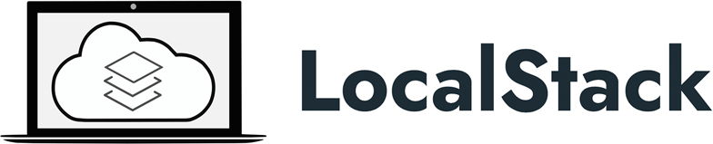
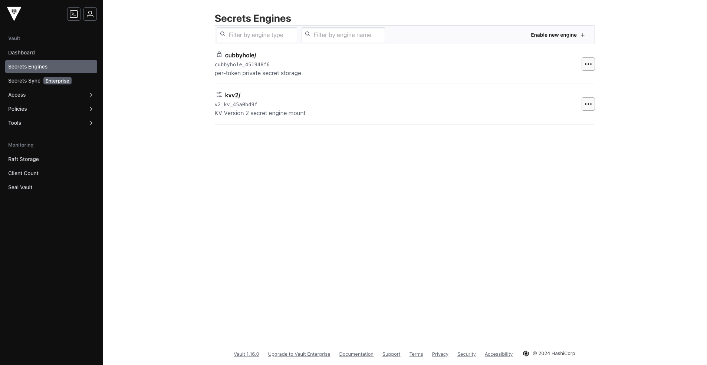
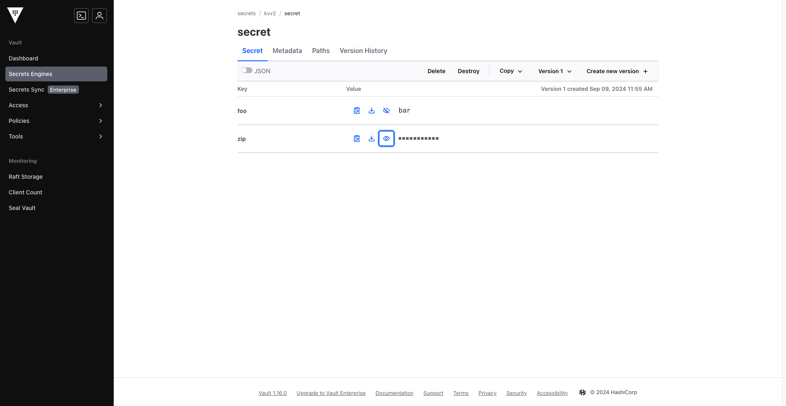
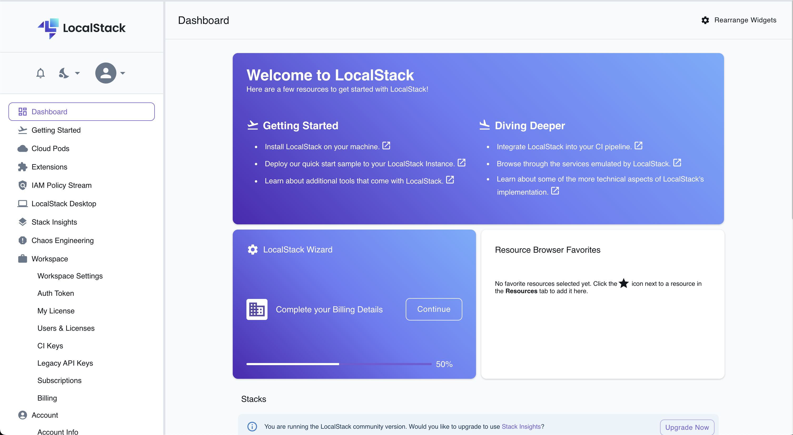
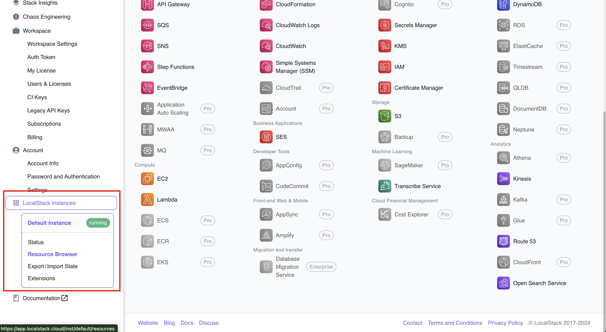
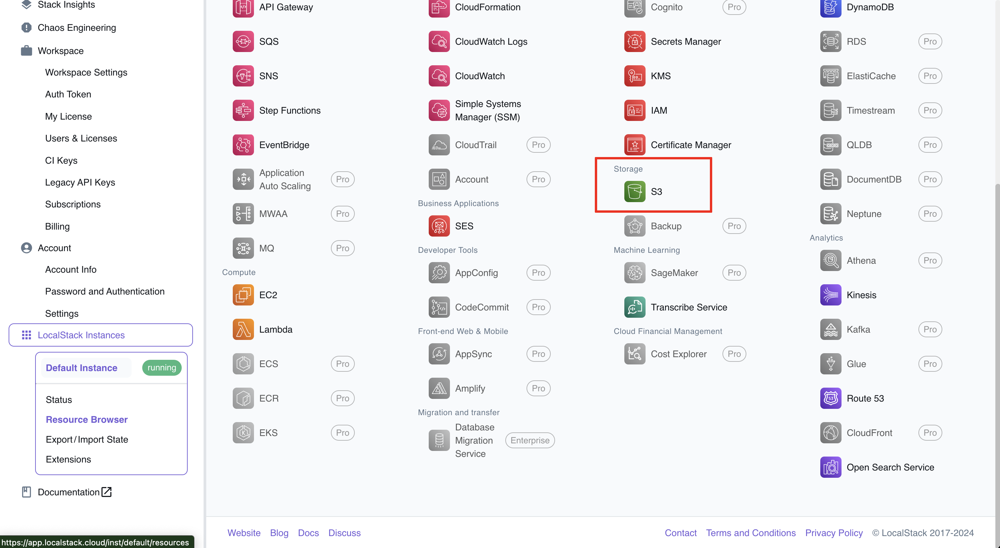
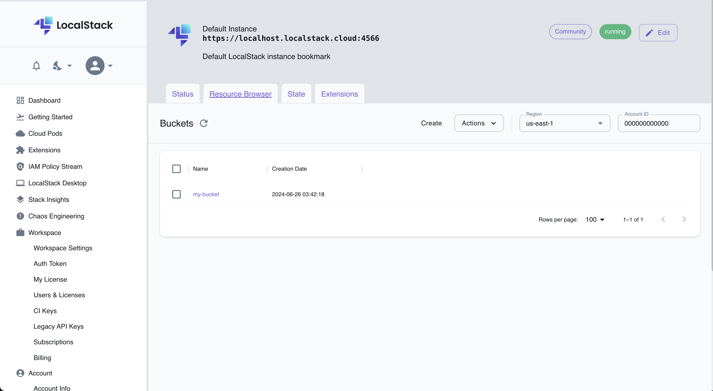

# LocalStack

<div align="center">
  
  <br><br>
  <p><strong>A local AWS cloud stack for development and testing</strong></p>
</div>

## 🚀 About

In this HashiQube DevOps lab, you'll get hands-on experience with LocalStack and Terraform.

LocalStack provides an easy-to-use test/mocking framework for developing cloud applications. It spins up a testing environment on your local machine that provides the same functionality and APIs as the real AWS cloud environment, allowing you to develop and test your cloud applications without incurring AWS costs.

## 📋 Provision

<!-- tabs:start -->

### **Github Codespace**

[](https://codespaces.new/star3am/hashiqube?quickstart=1)

```bash
bash docker/docker.sh
bash localstack/localstack.sh
bash terraform/terraform.sh
```

### **Vagrant**

```bash
vagrant up --provision-with basetools,localstack,terraform
```

### **Docker Compose**

```bash
docker compose exec hashiqube /bin/bash
bash hashiqube/basetools.sh
bash docker/docker.sh
bash docsify/docsify.sh
bash localstack/localstack.sh
bash terraform/terraform.sh
```

<!-- tabs:end -->

## 🛠️ Using Terraform with LocalStack

### Terraform Plan

To perform a Terraform plan:

1. Change directory to the LocalStack directory:

   ```bash
   cd /vagrant/localstack
   ```

2. Initialize Terraform and run the plan:

   ```bash
   terraform init
   terraform plan
   ```

### Terraform Apply

To apply your Terraform configuration:

1. Change directory to the LocalStack directory:

   ```bash
   cd /vagrant/localstack
   ```

2. Initialize Terraform, run a plan, and apply the changes:

   ```bash
   terraform init
   terraform plan
   terraform apply
   ```

## 🔄 Terraform and Vault Integration

Terraform has many providers, and you can use it to create resources across various platforms like GitHub, AWS, Azure, Cloudflare, and many others. You can also manage HashiCorp Vault with Terraform.

### Setting Up Terraform with Vault

1. Get Terraform and LocalStack running:
   - GitHub Codespace: `bash localstack/localstack.sh`
   - Vagrant: `vagrant up --provision-with basetools,localstack`

2. Bring Vault up:
   - GitHub Codespace: `bash vault/vault.sh`
   - Vagrant: `vagrant up --provision-with basetools,vault`

3. Run Terraform plan with the Vault module enabled:

   ```bash
   VAULT_TOKEN="YOUR_VAULT_TOKEN" TF_VAR_vault_enabled=true terraform plan
   ```

   Example output:

   ```bash
   # module.hashicorp-vault[0].vault_kv_secret_v2.example will be created
   + resource "vault_kv_secret_v2" "example" {
       + cas                 = 1
       + data                = (sensitive value)
       + data_json           = (sensitive value)
       + delete_all_versions = true
       + disable_read        = false
       + id                  = (known after apply)
       + metadata            = (known after apply)
       + mount               = "kvv2"
       + name                = "secret"
       + path                = (known after apply)

       + custom_metadata {
           + data         = {
               + "bar" = "12345"
               + "foo" = "vault@example.com"
             }
           + max_versions = 5
         }
     }

   # module.hashicorp-vault[0].vault_mount.kvv2 will be created
   + resource "vault_mount" "kvv2" {
       + accessor                     = (known after apply)
       + audit_non_hmac_request_keys  = (known after apply)
       + audit_non_hmac_response_keys = (known after apply)
       + default_lease_ttl_seconds    = (known after apply)
       + description                  = "KV Version 2 secret engine mount"
       + external_entropy_access      = false
       + id                           = (known after apply)
       + max_lease_ttl_seconds        = (known after apply)
       + options                      = {
           + "version" = "2"
         }
       + path                         = "kvv2"
       + seal_wrap                    = (known after apply)
       + type                         = "kv"
     }
   ```

4. Run Terraform apply with the Vault module enabled:

   ```bash
   VAULT_TOKEN="YOUR_VAULT_TOKEN" TF_VAR_vault_enabled=true terraform apply
   ```

   Example output:

   ```bash
   module.hashicorp-vault[0].vault_mount.kvv2: Creation complete after 1s [id=kvv2]
   module.hashicorp-vault[0].vault_kv_secret_v2.example: Creating...
   module.hashicorp-vault[0].vault_kv_secret_v2.example: Creation complete after 0s [id=kvv2/data/secret]
   ```

5. Access Vault to see the secret engine enabled:

<div align="center">
  
  <p><em>KV2 secret engine enabled in Vault</em></p>
</div>

<div align="center">
  
  <p><em>Secrets stored in the KV2 secret engine</em></p>
</div>

For further details, look at the code in `/vagrant/localstack`:

```hcl
# modules.tf
module "hashicorp-vault" {
  source = "../modules/vault-kv-secret"
  count  = var.vault_enabled ? 1 : 0
}
```

## 🌐 LocalStack Web Interface

After running the provisioner, you can create an account at [LocalStack Cloud](https://www.localstack.cloud/) to view your resources.

### Creating a LocalStack Account

1. Go to [https://www.localstack.cloud/](https://www.localstack.cloud/) and register, or sign up directly at [https://app.localstack.cloud/sign-up](https://app.localstack.cloud/sign-up)
2. You can register using SSO with GitHub credentials

Once logged in, you'll see the LocalStack Dashboard:

<div align="center">
  
  <p><em>LocalStack Cloud dashboard</em></p>
</div>

### Viewing LocalStack Instances

Scroll down in the left-hand menu to see your running instances:

<div align="center">
  
  <p><em>LocalStack running instances</em></p>
</div>

If you click on S3, you'll see the bucket created by Terraform:

<div align="center">
  
  <p><em>S3 service in LocalStack</em></p>
</div>

<div align="center">
  
  <p><em>S3 bucket details</em></p>
</div>

## 💻 Running Terraform Locally

You can also run Terraform commands on your local machine:

1. Install Terraform on your laptop:
   - Follow the instructions at [https://developer.hashicorp.com/terraform/tutorials/aws-get-started/install-cli](https://developer.hashicorp.com/terraform/tutorials/aws-get-started/install-cli)

2. Verify Terraform is installed:

   ```bash
   terraform -version
   ```

   Example output:

   ```bash
   Terraform v1.5.7
   on darwin_arm64
   + provider registry.terraform.io/hashicorp/aws v5.55.0
   + provider registry.terraform.io/hashicorp/null v3.2.2
   + provider registry.terraform.io/hashicorp/random v3.6.2

   Your version of Terraform is out of date! The latest version
   is 1.8.5. You can update by downloading from https://www.terraform.io/downloads.html
   ```

3. Navigate to the LocalStack directory:

   ```bash
   cd localstack
   pwd
   ```

   Output:

   ```bash
   /Users/riaan/workspace/personal/hashiqube/localstack
   ```

4. Initialize Terraform:

   ```bash
   terraform init
   ```

   Output:

```bash
   Initializing the backend...
   Initializing provider plugins...
   - Checking for available provider plugins...
   - Downloading plugin for provider "aws" (hashicorp/aws) 2.33.0...
   The following providers do not have any version constraints in configuration,
   so the latest version was installed.
   To prevent automatic upgrades to new major versions that may contain breaking
   changes, it is recommended to add version = "..." constraints to the
   corresponding provider blocks in configuration, with the constraint strings
   suggested below.
   * provider.aws: version = "~> 2.33"
   Terraform has been successfully initialized!
   You may now begin working with Terraform. Try running "terraform plan" to see
   any changes that are required for your infrastructure. All Terraform commands
   should now work.
   If you ever set or change modules or backend configuration for Terraform,
   rerun this command to reinitialize your working directory. If you forget, other
   commands will detect it and remind you to do so if necessary.
   ```

5. Run Terraform plan:

   ```bash
   terraform plan
   ```

6. Apply the Terraform configuration:

   ```bash
   terraform apply
   ```

7. Verify resources in LocalStack:

   ```bash
   vagrant ssh -c "awslocal s3 ls"
   ```

   Output:

   ```bash
   2024-06-25 17:42:18 my-bucket
   ```

## 📚 Further Learning

Thanks to the folks at LocalStack for publishing examples for learning Terraform. You can explore more examples from their GitHub repository:

1. Clone the samples repository:

   ```bash
   git clone git@github.com:localstack-samples/localstack-terraform-samples.git
   cd localstack-terraform-samples
   ```

2. Try the `demo-deploy` example:

   ```bash
   cd demo-deploy
   cp ../../provider.tf .
   ```

3. Initialize and apply the configuration:

   ```bash
   terraform init
   terraform plan
   terraform apply
   ```

## 🌐 Provision HashiQube on AWS, GCP, or Azure

HashiQube is a DevOps lab that runs all the HashiCorp products and popular Open Source Integrations. It can also help you learn Terraform!

Head over to the [HashiQube Cloud Tutorial](/localstack/hashiqube/README) to learn more.

## 🔧 LocalStack Terraform Examples

Here are some example Terraform configuration files for LocalStack:

### variables.tf

```hcl
variable "vault_enabled" {
  description = "Enable the vault module"
  type        = bool
  default     = false
}
```

### main.tf

```hcl
provider "aws" {
  region                      = "us-east-1"
  access_key                  = "mock_access_key"
  secret_key                  = "mock_secret_key"
  skip_credentials_validation = true
  skip_metadata_api_check     = true
  skip_requesting_account_id  = true

  endpoints {
    apigateway     = "http://localhost:4566"
    cloudformation = "http://localhost:4566"
    cloudwatch     = "http://localhost:4566"
    dynamodb       = "http://localhost:4566"
    es             = "http://localhost:4566"
    firehose       = "http://localhost:4566"
    iam            = "http://localhost:4566"
    kinesis        = "http://localhost:4566"
    lambda         = "http://localhost:4566"
    route53        = "http://localhost:4566"
    redshift       = "http://localhost:4566"
    s3             = "http://localhost:4566"
    secretsmanager = "http://localhost:4566"
    ses            = "http://localhost:4566"
    sns            = "http://localhost:4566"
    sqs            = "http://localhost:4566"
    ssm            = "http://localhost:4566"
    stepfunctions  = "http://localhost:4566"
    sts            = "http://localhost:4566"
  }
}

resource "aws_s3_bucket" "localstack-s3-bucket" {
  bucket = "localstack-s3-bucket"
  acl    = "public-read"
}
```

### outputs.tf

```hcl
output "s3_bucket_name" {
  value = aws_s3_bucket.localstack-s3-bucket.bucket
}
```

## 🔗 Additional Resources

- [LocalStack Official Website](https://localstack.cloud/)
- [LocalStack Terraform Samples](https://github.com/localstack-samples/localstack-terraform-samples)
- [LocalStack Pro Samples](https://github.com/localstack/localstack-pro-samples/blob/master/terraform-resources/test.tf)
- [Terraform AWS Provider - Custom Service Endpoints](https://www.terraform.io/docs/providers/aws/guides/custom-service-endpoints.html)
- [Terraform Documentation](https://www.terraform.io)
- [LocalStack GitHub Repository](https://github.com/localstack/localstack)
- [AWS CLI Local](https://github.com/localstack/awscli-local)

[filename](localstack.sh ':include :type=code')

[filename](provider.tf ':include :type=code')

[google ads](../googleads.html ':include :type=iframe width=100% height=300px')
