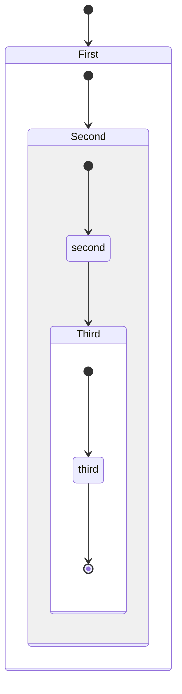
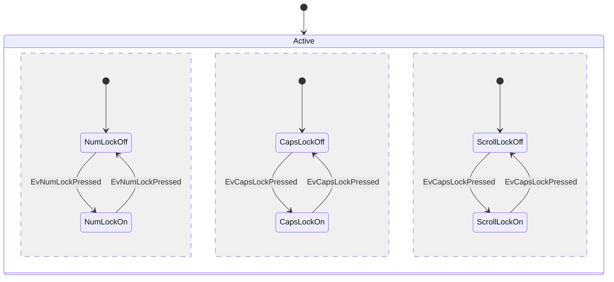
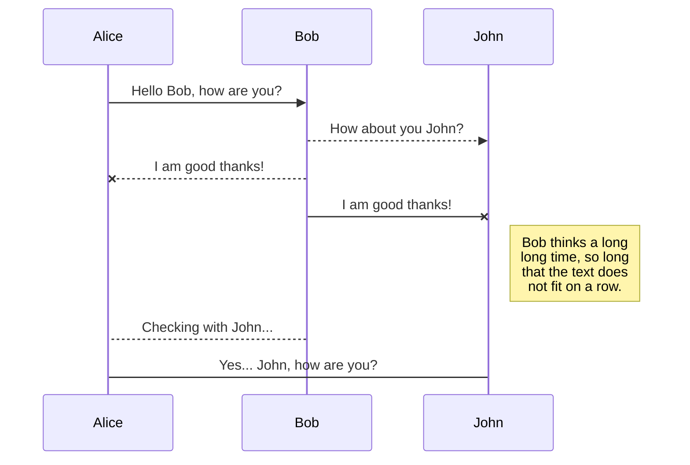
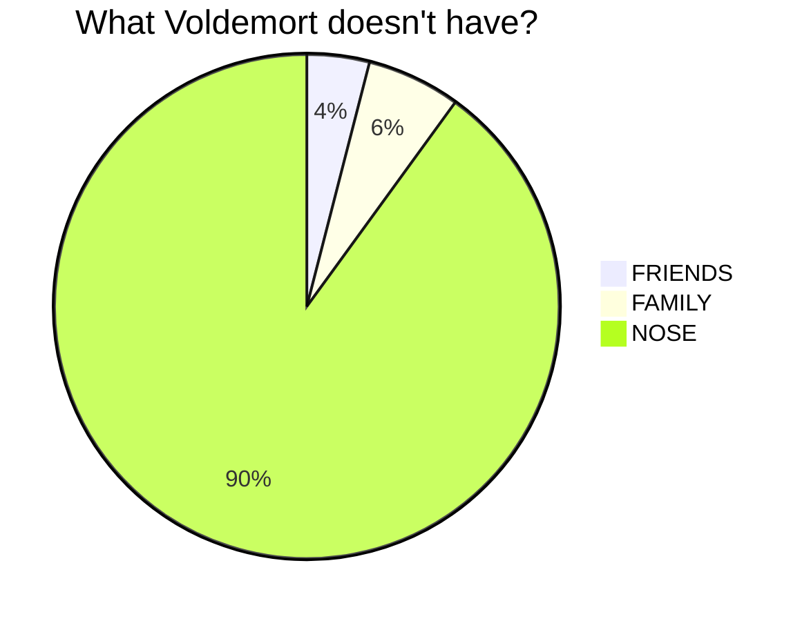
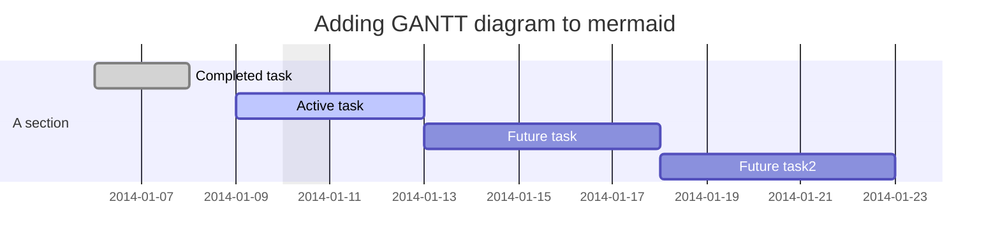
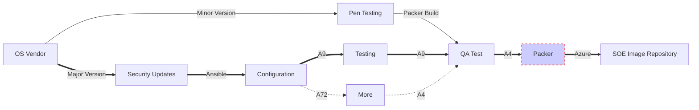

# Mermaid

<div align="center">
  <p><strong>Create diagrams and visualizations using text and code</strong></p>
</div>

## 🚀 Introduction

[Mermaid](https://mermaid-js.github.io/mermaid/#/) is a JavaScript-based diagramming and charting tool that renders Markdown-inspired text definitions to create and modify diagrams dynamically. It allows you to generate diagrams, flowcharts, and visualizations using simple text syntax, similar to how Markdown works for text formatting.

## 🛠️ Mermaid Live Editor

You can experiment with Mermaid using the [Mermaid Live Editor](https://mermaid-js.github.io/mermaid-live-editor/), which provides real-time preview of your diagrams.

<div class="iframe_container">
  <iframe src="https://mermaid-js.github.io/mermaid-live-editor/" height="600" frameborder="0" allowfullscreen="allowfullscreen"> </iframe>
</div>

## 📊 Diagram Examples

Mermaid supports various diagram types. Here are some examples:

### State Diagrams

#### Basic State Diagram



#### Keyboard State Diagram



### Sequence Diagrams

Sequence diagrams show how processes operate with one another and in what order.



### Pie Charts

Pie charts are useful for representing categorical data.



### Gantt Charts

Gantt charts are useful for project planning and scheduling.



### Git Graphs

Git graphs show git branching and merging operations.


### Flowcharts

Flowcharts can represent workflows or processes.



## 🧩 Diagram Syntax

### Basic Syntax Structure

Each diagram type in Mermaid has its own specific syntax, but they all follow a similar pattern:

1. Start with the diagram type (e.g., `graph`, `sequenceDiagram`, `gantt`)
2. Follow with the diagram-specific syntax
3. Wrap in a code block with either:
   - Plain code blocks: <code>```</code> and <code>```</code>
   - Mermaid code blocks: <code>```mermaid</code> and <code>```</code>

### Common Diagram Types and Their Starting Keywords

- **Flowcharts**: `graph` or `flowchart`
- **Sequence Diagrams**: `sequenceDiagram`
- **Class Diagrams**: `classDiagram`
- **State Diagrams**: `stateDiagram`
- **Entity Relationship Diagrams**: `erDiagram`
- **User Journey**: `journey`
- **Gantt Charts**: `gantt`
- **Pie Charts**: `pie`
- **Git Graphs**: `gitGraph`

## 📚 Resources

- [Mermaid Official Website](https://mermaid-js.github.io/mermaid/#/)
- [Mermaid Live Editor](https://mermaid-js.github.io/mermaid-live-editor/)
- [GitHub Repository](https://github.com/mermaid-js/mermaid)
- [Documentation](https://mermaid-js.github.io/mermaid/#/n00b-overview)

## 🔧 Integration

Mermaid can be integrated into various platforms:

- **Markdown**: Many Markdown processors support Mermaid
- **Documentation Tools**: Like Docusaurus, VuePress, and Jekyll
- **Note-taking Apps**: Like Obsidian and Notion
- **Online Editors**: Like CodiMD and HackMD
- **Version Control**: GitHub, GitLab, and Bitbucket support Mermaid in Markdown

## 💡 Tips for Using Mermaid

1. **Start Simple**: Begin with basic diagrams and gradually add complexity
2. **Use the Live Editor**: Test your diagrams in the live editor before embedding them
3. **Check Syntax**: Mermaid is sensitive to syntax; ensure proper spacing and indentation
4. **Customize Appearance**: Use styling options to enhance your diagrams
5. **Responsive Design**: Consider how your diagrams will appear on different screen sizes
