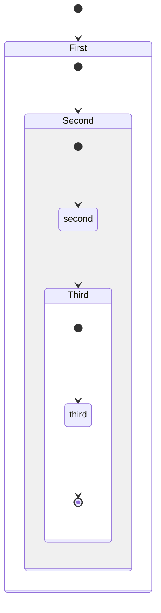
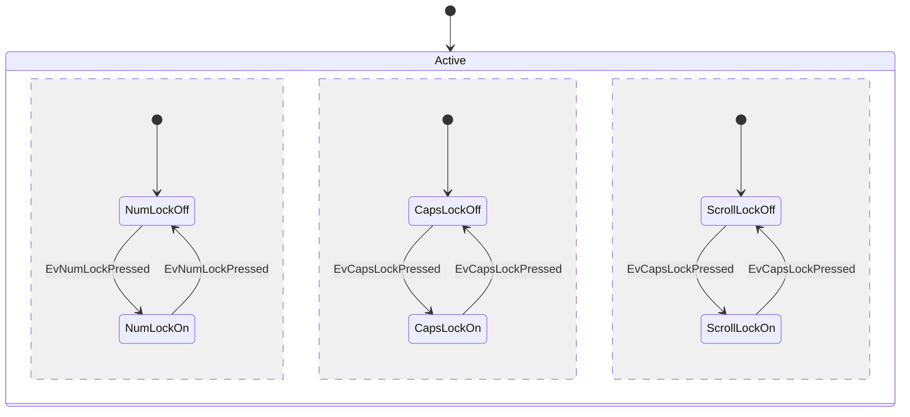
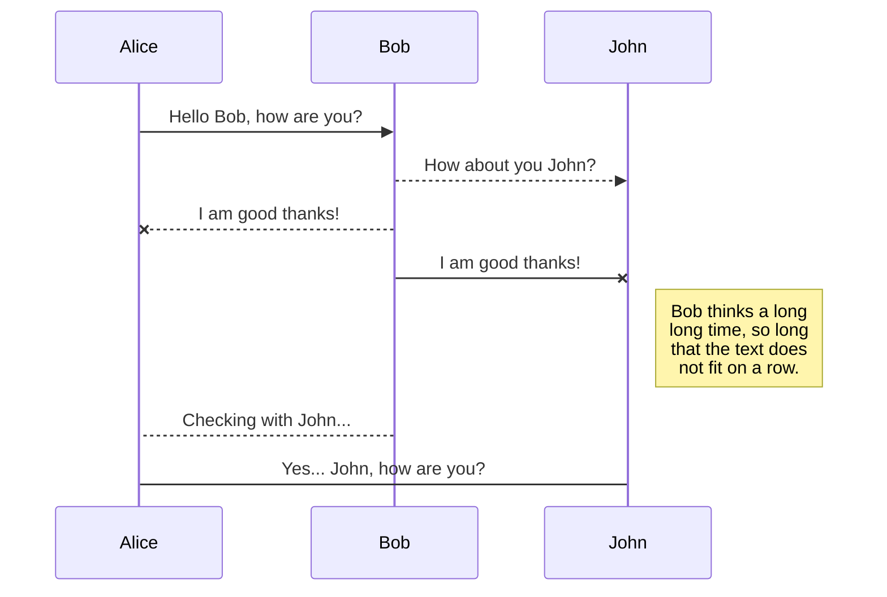
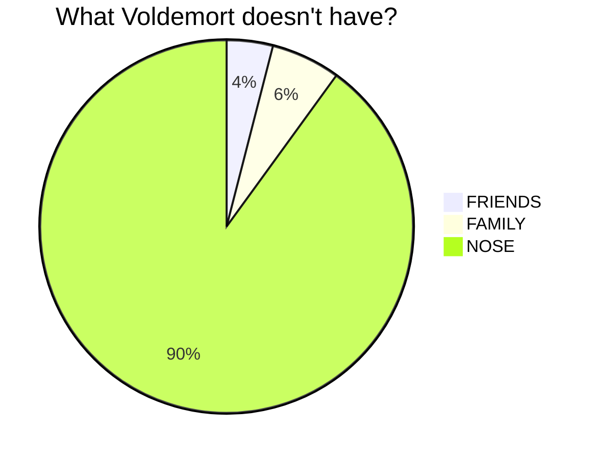
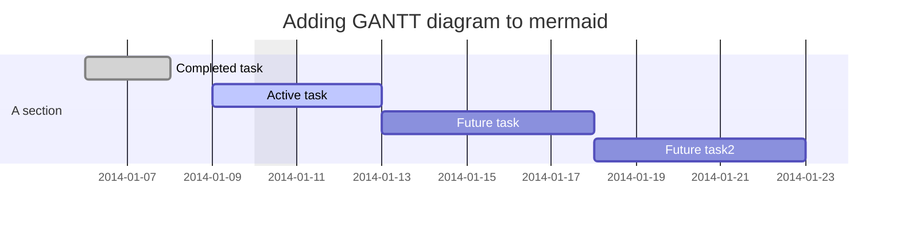
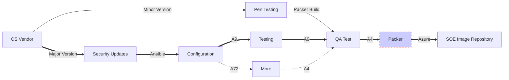

## Mermaid
https://mermaid-js.github.io/mermaid/#/

Generation of diagram and flowchart from text in a similar manner as markdown

Mermaid Live Editor: https://mermaid-js.github.io/mermaid-live-editor/

## Mermaid Live Editor
<div class="iframe_container">
  <iframe src="https://mermaid-js.github.io/mermaid-live-editor/" height="1015" frameborder="0" allowfullscreen="allowfullscreen"> </iframe>
</div>

### Mermaid Examples
```
stateDiagram
    [*] --> First

    state First {
        [*] --> Second

        state Second {
            [*] --> second
            second --> Third

            state Third {
                [*] --> third
                third --> [*]
            }
        }
    }
```

```
stateDiagram
        [*] --> Active

        state Active {
            [*] --> NumLockOff
            NumLockOff --> NumLockOn : EvNumLockPressed
            NumLockOn --> NumLockOff : EvNumLockPressed
            --
            [*] --> CapsLockOff
            CapsLockOff --> CapsLockOn : EvCapsLockPressed
            CapsLockOn --> CapsLockOff : EvCapsLockPressed
            --
            [*] --> ScrollLockOff
            ScrollLockOff --> ScrollLockOn : EvCapsLockPressed
            ScrollLockOn --> ScrollLockOff : EvCapsLockPressed
        }
```  

```
sequenceDiagram
    Alice ->> Bob: Hello Bob, how are you?
    Bob-->>John: How about you John?
    Bob--x Alice: I am good thanks!
    Bob-x John: I am good thanks!
    Note right of John: Bob thinks a long<br/>long time, so long<br/>that the text does<br/>not fit on a row.

    Bob-->Alice: Checking with John...
    Alice->John: Yes... John, how are you?
```



```
pie title What Voldemort doesn't have?
         "FRIENDS" : 2
         "FAMILY" : 3
         "NOSE" : 45
```


```
gantt
dateFormat  YYYY-MM-DD
title Adding GANTT diagram to mermaid
excludes weekdays 2014-01-10

section A section
Completed task            :done,    des1, 2014-01-06,2014-01-08
Active task               :active,  des2, 2014-01-09, 3d
Future task               :         des3, after des2, 5d
Future task2               :         des4, after des3, 5d
```

```
gitGraph:
options
{
    "nodeSpacing": 150,
    "nodeRadius": 10
}
end
commit
branch newbranch
checkout newbranch
commit
commit
checkout master
commit
commit
merge newbranch
```

```
graph LR
a1[OS Vendor] --> | Minor Version | a3[Pen Testing]
a3[Pen Testing] --> | Packer Build | a4[QA Test]
a1[OS Vendor] ==> | Major Version | a5[Security Updates]
a5[Security Updates] ==> | Ansible | Configuration
Configuration ==> |A9| Testing
Testing ==> | A9 | a4[QA Test]
a4[QA Test] ==> | A4 | a2[Packer]
Configuration -.-> | A72 | More
More -.-> | A4 | a4[QA Test]
a2[Packer] ==> | Azure | a6[SOE Image Repository]
style a2 fill:#ccf,stroke:#f66,stroke-width:2px,stroke-dasharray: 5, 5
```

