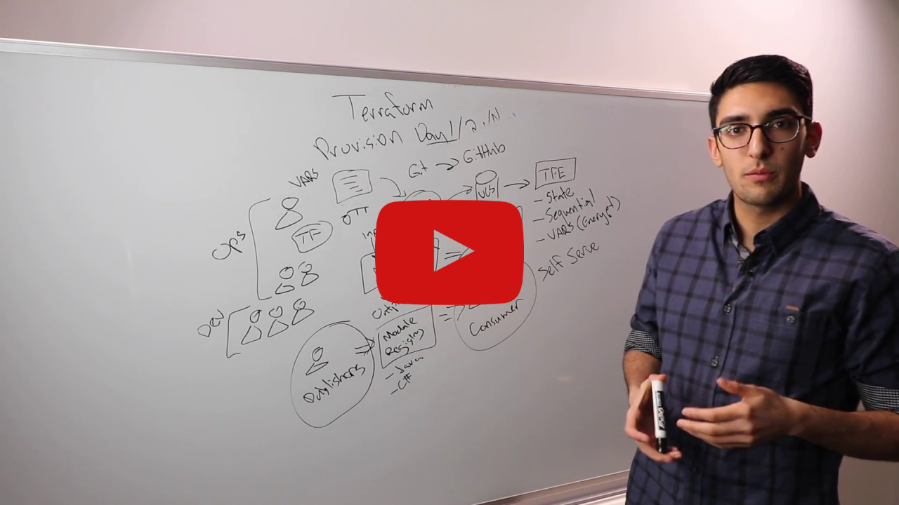
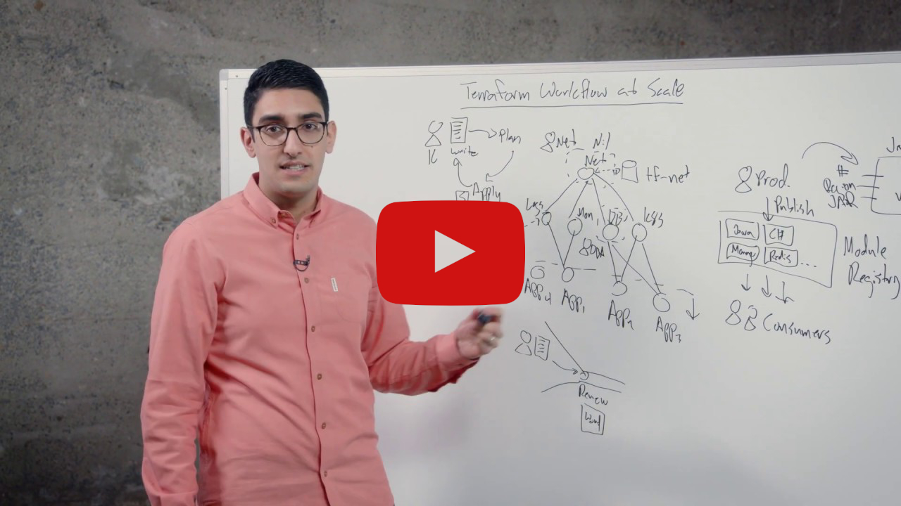
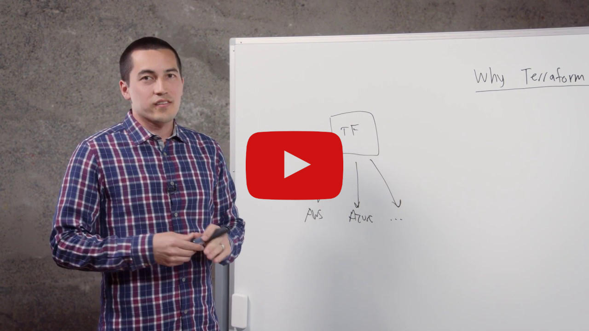

# Terraform

<div align="center">
  <p><strong>Infrastructure as Code for managing cloud resources across multiple providers</strong></p>
</div>


## 🚀 Introduction

In this HashiQube DevOps lab, you will get hands-on experience with HashiCorp Terraform. Terraform is an open-source infrastructure as code software tool that enables users to define and provision datacenter infrastructure using a high-level configuration language known as HashiCorp Configuration Language (HCL), or optionally JSON.

### Why Terraform

- Provides a high-level abstraction of infrastructure (IaC)
- Allows for composition and combination
- Supports parallel management of resources (graph, fast)
- Separates planning from execution (dry-run)

Because of this flexibility, Terraform can be used to solve many different problems.

[](https://www.youtube.com/watch?v=h970ZBgKINg)

## 📰 Latest News

- [Terraform 1.6 adds a test framework for enhanced code validation](https://www.hashicorp.com/blog/terraform-1-6-adds-a-test-framework-for-enhanced-code-validation)
- [Terraform 1.5 brings config-driven import and checks](https://www.hashicorp.com/blog/terraform-1-5-brings-config-driven-import-and-checks)
- [Terraform 1.4 improves the CLI experience for Terraform Cloud](https://www.hashicorp.com/blog/terraform-1-4-improves-the-cli-experience-for-terraform-cloud)
- [Terraform 1.3 Improves Extensibility and Maintainability of Terraform Modules](https://www.hashicorp.com/blog/terraform-1-3-improves-extensibility-and-maintainability-of-terraform-modules)
- [Terraform 1.2 Improves Exception Handling and Updates to the CLI-driven Workflow](https://www.hashicorp.com/blog/terraform-1-2-improves-exception-handling-and-updates-to-the-cli-driven-workflow)

## 🛠️ Provision

Choose one of the following methods to set up your environment:

<!-- tabs:start -->

### **Github Codespace**

[](https://codespaces.new/star3am/hashiqube?quickstart=1)

```bash
bash docker/docker.sh
bash localstack/localstack.sh
bash terraform/terraform.sh
```

### **Vagrant**

```bash
vagrant up --provision-with basetools,docsify,docker,localstack,terraform
```

### **Docker Compose**

```bash
docker compose exec hashiqube /bin/bash
bash hashiqube/basetools.sh
bash docker/docker.sh
bash docsify/docsify.sh
bash localstack/localstack.sh
bash terraform/terraform.sh
```
<!-- tabs:end -->

## 🧩 Terraform Basics

### Terraform Lifecycle

The Terraform lifecycle consists of the following four phases:

```bash
terraform init -> terraform plan -> terraform apply -> terraform destroy
```

### Terraform Language

HashiCorp Configuration Language (HCL) includes:

- Variables
- Outputs
- Resources
- Providers

Providers extend the language functionality to support Infrastructure as Code (IaC) for different platforms.

### Terraform Modules and Providers

Modules build and extend on the resources defined by providers:

|Modules | Providers|
|--------|----------|
|Container of multiple resources used together | Defines resource types that Terraform manages|
|Sourced through a registry or local files | Configure a specific infrastructure platform|
|Consists of .tf and/or .tf.json files | Contains instructions for API interactions|
|Re-usable Terraform configuration | Written in Go Language|
|Built on top of providers | Foundation for modules|

### Example Terraform Plan

Here's an example of what a `terraform plan` looks like:

```hcl
Refreshing Terraform state in-memory prior to plan...
The refreshed state will be used to calculate this plan, but will not be
persisted to local or remote state storage.

null_resource.ec2_instance_disk_allocations_indexed["3"]: Refreshing state... [id=8937245650602921629]
null_resource.ec2_instance_disk_allocations_indexed["5"]: Refreshing state... [id=7730763927227710655]
null_resource.ec2_instance_disk_allocations_indexed["1"]: Refreshing state... [id=2667993646128215089]
null_resource.ec2_instance_disk_allocations_indexed["2"]: Refreshing state... [id=2799175647628082337]
null_resource.ec2_instance_disk_allocations_indexed["4"]: Refreshing state... [id=3516596870015825764]
null_resource.ec2_instance_disk_allocations_indexed["0"]: Refreshing state... [id=2638599405833480007]
aws_s3_bucket.localstack-s3-bucket: Refreshing state... [id=localstack-s3-bucket]

------------------------------------------------------------------------

An execution plan has been generated and is shown below.
Resource actions are indicated with the following symbols:
  + create

Terraform will perform the following actions:

  # aws_s3_bucket.localstack-s3-bucket will be created
  + resource "aws_s3_bucket" "localstack-s3-bucket" {
      + acceleration_status         = (known after apply)
      + acl                         = "public-read"
      + arn                         = (known after apply)
      + bucket                      = "localstack-s3-bucket"
      + bucket_domain_name          = (known after apply)
      + bucket_regional_domain_name = (known after apply)
      + force_destroy               = false
      + hosted_zone_id              = (known after apply)
      + id                          = (known after apply)
      + region                      = (known after apply)
      + request_payer               = (known after apply)
      + website_domain              = (known after apply)
      + website_endpoint            = (known after apply)

      + versioning {
          + enabled    = (known after apply)
          + mfa_delete = (known after apply)
        }
    }

Plan: 1 to add, 0 to change, 0 to destroy.
```

## ⚙️ Terraform Provisioner Script

The `terraform.sh` script handles the installation and configuration of Terraform:

```bash
[filename](terraform.sh ':include :type=code')
```

## 📊 Terraform Best Practices

Watch this whiteboard video by Terraform co-creator Armon Dadgar to learn about high-scale Terraform best practices:

[](https://www.youtube.com/watch?v=9c0s93GcXVw)

## ☁️ Terraform Cloud

[](https://www.youtube.com/watch?v=ihAKcn9SE_M)

[Terraform Cloud](https://app.terraform.io/) is a SaaS platform that simplifies Terraform usage by:

- Managing state files remotely instead of locally
- Providing version control and backups for state files
- Enabling team collaboration and governance
- Centralizing runs with plan approvals
- Maintaining a history of all infrastructure changes

### Collaboration and Governance

Terraform Cloud adds several key capabilities to the Terraform workflow:

- Centralized runs through Terraform Cloud instead of direct provider access
- Complete history of all infrastructure changes
- Approval workflows for infrastructure changes
- Access control for team members
- Standardized Terraform workflows across teams

> 💡 You can still use the same familiar `terraform plan` and `terraform apply` commands with Terraform Cloud - it automatically uses Terraform Cloud in the backend.

### Authentication Options

- [Azure](https://registry.terraform.io/providers/hashicorp/azurerm/latest/docs/guides/service_principal_client_secret#creating-a-service-principal)
- [AWS](https://registry.terraform.io/providers/hashicorp/aws/latest/docs#environment-variables)
- [GCP](https://registry.terraform.io/providers/hashicorp/google/latest/docs/guides/provider_reference.html#authentication-configuration)

## 🌐 HashiQube Multi-Cloud

Terraform Cloud can be used to build and test Terraform changes for the HashiQube Multi-Cloud Terraform Registry Module:

- [HashiQube Multi-Cloud](https://registry.terraform.io/modules/star3am/hashiqube/hashicorp/latest)
- [Module Documentation](/multi-cloud/#terraform-hashicorp-hashiqube)


### Terraform Cloud Variables

| Key | Value | Category |
|-----|-------|----------|
| aws_region | ap-southeast-2 | terraform |
| deploy_to_aws | true | terraform |
| deploy_to_azure | true | terraform |
| deploy_to_gcp | true | terraform |
| gcp_project | SENSITIVE | terraform |
| gcp_region | australia-southeast1 | terraform |
| ssh_public_key | SENSITIVE | terraform |
| ARM_CLIENT_ID | SENSITIVE | env |
| ARM_CLIENT_SECRET | SENSITIVE | env |
| ARM_SUBSCRIPTION_ID | SENSITIVE | env |
| ARM_TENANT_ID | SENSITIVE | env |
| AWS_ACCESS_KEY_ID | SENSITIVE | env |
| AWS_SECRET_ACCESS_KEY | SENSITIVE | env |
| AWS_REGION | ap-southeast-2 | env |
| GOOGLE_CREDENTIALS | SENSITIVE | env |

> 💡 Google credentials can be generated by passing the Google Authentication JSON file to this command:
> `cat ~/.gcp/credentials.json | jq -c`

## 🏢 Terraform Enterprise

[Terraform Enterprise](https://www.terraform.io/docs/enterprise/index.html) is the self-hosted distribution of Terraform Cloud. It offers enterprises a private instance of the Terraform Cloud application, with no resource limits and additional enterprise-grade features like:

- Audit logging
- SAML single sign-on
- Advanced security controls

### Setup Instructions

1. Make sure you have a Terraform License file placed in the HashiCorp directory (e.g., `hashicorp/ptfe-license.rli`)
2. Run the following command:

   ```bash
   vagrant up --provision-with terraform-enterprise
   ```

3. System logs and Docker logs will be followed (in red). This is normal and for status output.
4. The installation takes a while. It will finish when Terraform Enterprise is ready.
5. When done, you'll see: `++++ To finish the installation go to http://10.9.99.10:8800`


## 🧰 Terraform Development Environment

For a comprehensive guide on setting up a Terraform development environment, check out this article:
[Top Gun Terraform Development Environment](https://medium.com/@riaan.nolan/top-gun-terraform-development-environment-60ac00d49577)

### Terraform Modules Library

The [Terraform Modules Library](https://github.com/star3am/terraform-modules-library) provides:

- Pre-coded modules to quickly start development
- Tools like TFEnv, Terraform Docs, and Linters
- VSCode's Dev/Remote containers for a portable development setup


### Development Features

The Terraform Modules Library includes several tools and features to improve the developer experience:

| Product | State |
|-------|---------|
| VSCode Dev Container | ✓ |
| Pre-Commit | ✓ |
| Terratest | ✘ |
| Terraform | ✓ |
| Terragrunt | ✓ |
| TFEnv | ✓ |
| TGEnv | ✓ |
| TFsec | ✓ |
| AWS | ✓ |
| GCP | ✓ |
| Azure | ✓ |
| Custom | ✓ |
| Terraform Lint | ✓ |
| Terraform Format | ✓ |
| Terraform Validate | ✓ |
| Terraform Docs | ✓ |


### Getting Started with the Dev Environment

1. Install VSCode, Docker Desktop, and Git
2. Clone the repository locally
3. Open the repository folder in VSCode
4. Launch in Remote Dev Container
5. Create your module in the designated cloud module folder
6. Use `./run.sh` to check your Terraform syntax and create documentation


### Cloud Operating Model


## 📚 Resources

- [Terraform Official Website](https://www.terraform.io/)
- [Terraform Cloud](https://app.terraform.io/)
- [Terraform Enterprise Documentation](https://www.terraform.io/docs/enterprise/index.html)
- [Terraform Modules Library](https://github.com/star3am/terraform-modules-library)
- [Top Gun Terraform Development Environment](https://medium.com/@riaan.nolan/top-gun-terraform-development-environment-60ac00d49577)
