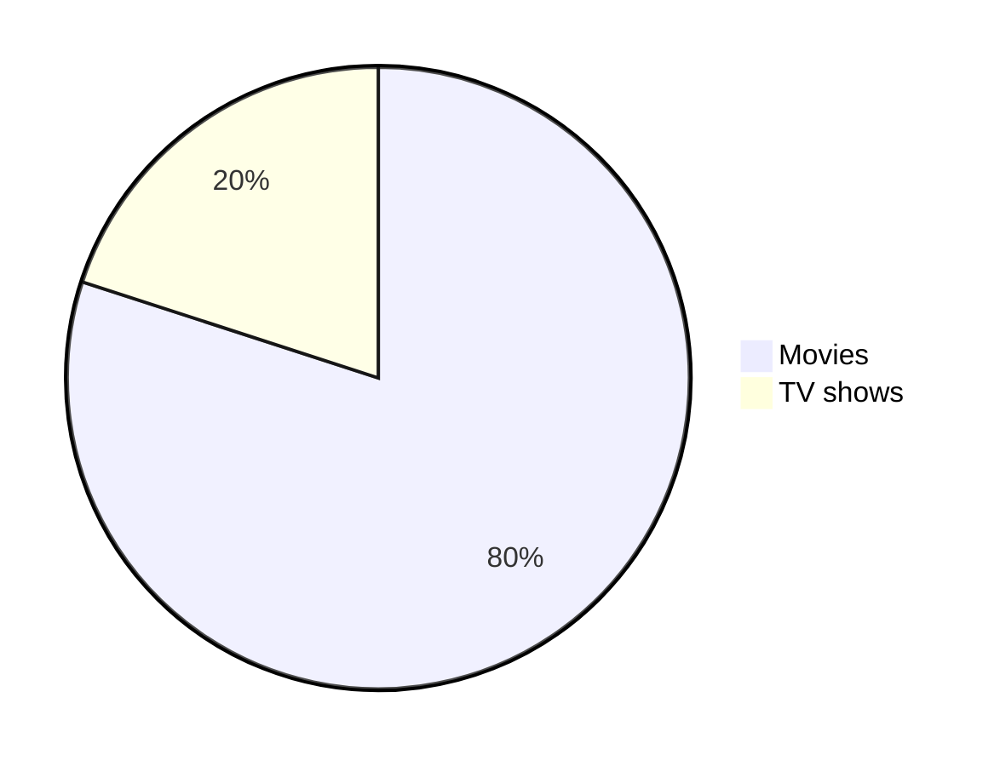

# Typography

<div align="center">
  <p><strong>A comprehensive guide to Markdown formatting and styling options</strong></p>
</div>

## 🚀 Introduction

The Markdown Guide is a comprehensive Markdown reference designed for both novices and experts. This guide was born out of frustration with existing Markdown references that are incomplete and inadequate.

## 📚 Resources

- [Markdown Guide Official Website](https://www.markdownguide.org/)
- [Markdown Guide GitHub Repository](https://github.com/mattcone/markdown-guide)
- [GitHub Markdown Documentation](https://docs.github.com/en/get-started/writing-on-github/getting-started-with-writing-and-formatting-on-github/basic-writing-and-formatting-syntax)
- [Markdown Cheatsheet](https://github.com/lifeparticle/Markdown-Cheatsheet)
- [The Ultimate Markdown Cheat Sheet](https://towardsdatascience.com/the-ultimate-markdown-cheat-sheet-3d3976b31a0)

## 🔤 Headings

Markdown supports multiple ways to create headings:

### Using Hash Symbols

```markdown
# Heading 1
## Heading 2
### Heading 3
#### Heading 4
##### Heading 5
```

# Heading 1

## Heading 2

### Heading 3

#### Heading 4

##### Heading 5

### Using HTML

```html
<h1>Heading 1</h1>
<h2>Heading 2</h2>
<h3>Heading 3</h3>
<h4>Heading 4</h4>
<h5>Heading 5</h5>
```

<h1>Heading 1</h1>
<h2>Heading 2</h2>
<h3>Heading 3</h3>
<h4>Heading 4</h4>
<h5>Heading 5</h5>

### Using Underlines

```markdown
Heading 1
=
Heading 2
-
```

Heading 1
=

Heading 2
-

## 📝 Text Styles

### Bold Text

```markdown
**The quick brown fox jumps over the lazy dog.**
__The quick brown fox jumps over the lazy dog.__
<strong>The quick brown fox jumps over the lazy dog.</strong>
```

**The quick brown fox jumps over the lazy dog.**

**The quick brown fox jumps over the lazy dog.**

<strong>The quick brown fox jumps over the lazy dog.</strong>

### Italic Text

```markdown
*The quick brown fox jumps over the lazy dog.*
_The quick brown fox jumps over the lazy dog._
<em>The quick brown fox jumps over the lazy dog.</em>
```

*The quick brown fox jumps over the lazy dog.*

*The quick brown fox jumps over the lazy dog.*

<em>The quick brown fox jumps over the lazy dog.</em>

### Bold and Italic Text

```markdown
**_The quick brown fox jumps over the lazy dog._**
<strong><em>The quick brown fox jumps over the lazy dog.</em></strong>
```

***The quick brown fox jumps over the lazy dog.***

<strong><em>The quick brown fox jumps over the lazy dog.</em></strong>

### Blockquotes

```markdown
> The quick brown fox jumps over the lazy dog.

> The quick brown fox jumps over the lazy dog.
> 
> The quick brown fox jumps over the lazy dog.

> The quick brown fox jumps over the lazy dog.
>> Nested quote: The quick brown fox jumps over the lazy dog.
>>> Deeper nested quote: The quick brown fox jumps over the lazy dog.

> **Bold text in a blockquote** *with some italic text too.*
```

> The quick brown fox jumps over the lazy dog.

> The quick brown fox jumps over the lazy dog.
>
> The quick brown fox jumps over the lazy dog.

> The quick brown fox jumps over the lazy dog.
>> The quick brown fox jumps over the lazy dog.
>>> The quick brown fox jumps over the lazy dog.

> **The quick brown fox** *jumps over the lazy dog.*

### Other Text Formatting

#### Monospaced Text

```html
<samp>The quick brown fox jumps over the lazy dog.</samp>
```

<samp>The quick brown fox jumps over the lazy dog.</samp>

#### Underlined Text

```html
<ins>The quick brown fox jumps over the lazy dog.</ins>
```

<ins>The quick brown fox jumps over the lazy dog.</ins>

#### Strikethrough Text

```markdown
~~The quick brown fox jumps over the lazy dog.~~
```

~~The quick brown fox jumps over the lazy dog.~~

#### Boxed Text

```html
<table><tr><td>The quick brown fox jumps over the lazy dog.</td></tr></table>
```

<table><tr><td>The quick brown fox jumps over the lazy dog.</td></tr></table>

#### Superscript and Subscript

```markdown
2 <sup>53-1</sup> and -2 <sup>53-1</sup> 

Subscript <sub>The quick brown fox jumps over the lazy dog.</sub>
Superscript <sup>The quick brown fox jumps over the lazy dog.</sup>
```

2 <sup>53-1</sup> and -2 <sup>53-1</sup>

Subscript <sub>The quick brown fox jumps over the lazy dog.</sub>

Superscript <sup>The quick brown fox jumps over the lazy dog.</sup>

## 🎨 Syntax Highlighting

Markdown supports syntax highlighting for code blocks:

```
public static String monthNames[] = {"January", "February", "March", "April", "May", "June", "July", "August", "September", "October", "November", "December"};
```

Specify a language for proper highlighting:

```java
public static String monthNames[] = {"January", "February", "March", "April", "May", "June", "July", "August", "September", "October", "November", "December"};
```

## 📐 Alignments

### Left Alignment

```html
<p align="left">

</p>
```

<p align="left">

</p>

### Center Alignment

```html
<p align="center">

</p>
```

<p align="center">

</p>

### Right Alignment

```html
<p align="right">

</p>
```

<p align="right">

</p>

### Text Alignment Example

```html
<h3 align="center"> My latest Medium posts </h3>
```

<h3 align="center"> My latest Medium posts </h3>

## 📊 Tables

### HTML Table

```html
<table>
<tr>
<td width="33%"">
The quick brown fox jumps over the lazy dog.
</td>
<td width="33%">
The quick brown fox jumps over the lazy dog.
</td>
<td width="33%">
The quick brown fox jumps over the lazy dog.
</td>
</tr>
</table>
```

<table>
<tr>
<td width="33%"">
The quick brown fox jumps over the lazy dog.
</td>
<td width="33%">
The quick brown fox jumps over the lazy dog.
</td>
<td width="33%">
The quick brown fox jumps over the lazy dog.
</td>
</tr>
</table>

### Markdown Tables

```markdown
| Default | Left align | Center align | Right align |
| - | :- | :-: | -: |
| 9999999999 | 9999999999 | 9999999999 | 9999999999 |
| 999999999 | 999999999 | 999999999 | 999999999 |
| 99999999 | 99999999 | 99999999 | 99999999 |
| 9999999 | 9999999 | 9999999 | 9999999 |
```

| Default | Left align | Center align | Right align |
| - | :- | :-: | -: |
| 9999999999 | 9999999999 | 9999999999 | 9999999999 |
| 999999999 | 999999999 | 999999999 | 999999999 |
| 99999999 | 99999999 | 99999999 | 99999999 |
| 9999999 | 9999999 | 9999999 | 9999999 |

You can also format tables with different styles:

```markdown
| Default    | Left align | Center align | Right align |
| ---------- | :--------- | :----------: | ----------: |
| 9999999999 | 9999999999 | 9999999999   | 9999999999  |
| 999999999  | 999999999  | 999999999    | 999999999   |
| 99999999   | 99999999   | 99999999     | 99999999    |
| 9999999    | 9999999    | 9999999      | 9999999     |
```

| Default    | Left align | Center align | Right align |
| ---------- | :--------- | :----------: | ----------: |
| 9999999999 | 9999999999 | 9999999999   | 9999999999  |
| 999999999  | 999999999  | 999999999    | 999999999   |
| 99999999   | 99999999   | 99999999     | 99999999    |
| 9999999    | 9999999    | 9999999      | 9999999     |

Alternative syntax (no pipe at beginning/end):

```markdown
Default    | Left align | Center align | Right align
---------- | :--------- | :----------: | ----------:
9999999999 | 9999999999 | 9999999999   | 9999999999 
999999999  | 999999999  | 999999999    | 999999999  
99999999   | 99999999   | 99999999     | 99999999   
9999999    | 9999999    | 9999999      | 9999999 
```

Default    | Left align | Center align | Right align
---------- | :--------- | :----------: | ----------:
9999999999 | 9999999999 | 9999999999   | 9999999999
999999999  | 999999999  | 999999999    | 999999999  
99999999   | 99999999   | 99999999     | 99999999
9999999    | 9999999    | 9999999      | 9999999

### Nested Tables

```html
<table>
<tr>
<th>Heading 1</th>
<th>Heading 2</th>
</tr>
<tr>
<td>

| A | B | C |
|--|--|--|
| 1 | 2 | 3 |

</td><td>

| A | B | C |
|--|--|--|
| 1 | 2 | 3 |

</td></tr> </table>
```

<table>
<tr>
<th>Heading 1</th>
<th>Heading 2</th>
</tr>
<tr>
<td>

| A | B | C |
|--|--|--|
| 1 | 2 | 3 |

</td><td>

| A | B | C |
|--|--|--|
| 1 | 2 | 3 |

</td></tr> </table>

### Line Breaks in Table Cells

```markdown
| A | B | C |
|---|---|---|
| 1 | 2 | 3 <br/> 4 <br/> 5 |
```

| A | B | C |
|---|---|---|
| 1 | 2 | 3 <br/> 4 <br/> 5 |

### Code Comparison Table

```html
<table>
<tr>
<th>Before Hoisting</th>
<th>After Hoisting</th>
</tr>
<tr>
<td>
<pre lang="js">
console.log(fullName); // undefined
fullName = "Dariana Trahan";
console.log(fullName); // Dariana Trahan
var fullName;
</pre>
</td>
<td>
<pre lang="js">
var fullName;
console.log(fullName); // undefined
fullName = "Dariana Trahan";
console.log(fullName); // Dariana Trahan
</pre>
</td>
</tr>
</table>
```

<table>
<tr>
<th>Before Hoisting</th>
<th>After Hoisting</th>
</tr>
<tr>
<td>
<pre lang="js">
console.log(fullName); // undefined
fullName = "Dariana Trahan";
console.log(fullName); // Dariana Trahan
var fullName;
</pre>
</td>
<td>
<pre lang="js">
var fullName;
console.log(fullName); // undefined
fullName = "Dariana Trahan";
console.log(fullName); // Dariana Trahan
</pre>
</td>
</tr>
</table>

## 🔗 Links

### Basic Links

```markdown
[The-Ultimate-Markdown-Cheat-Sheet](https://github.com/lifeparticle/Markdown-Cheatsheet)
```

[The-Ultimate-Markdown-Cheat-Sheet](https://github.com/lifeparticle/The-Ultimate-Markdown-Cheat-Sheet)

### Reference-Style Links

```markdown
[The-Ultimate-Markdown-Cheat-Sheet][reference text]

[The-Ultimate-Markdown-Cheat-Sheet][1]

[Markdown-Cheat-Sheet]

[reference text]: https://github.com/lifeparticle/Markdown-Cheatsheet
[1]: https://github.com/lifeparticle/Markdown-Cheatsheet
[Markdown-Cheat-Sheet]: https://github.com/lifeparticle/Markdown-Cheatsheet
```

[The-Ultimate-Markdown-Cheat-Sheet][reference text]

[The-Ultimate-Markdown-Cheat-Sheet][1]

[Markdown-Cheat-Sheet]

[reference text]: https://github.com/lifeparticle/The-Ultimate-Markdown-Cheat-Sheet
[1]: https://github.com/lifeparticle/The-Ultimate-Markdown-Cheat-Sheet
[Markdown-Cheat-Sheet]: https://github.com/lifeparticle/The-Ultimate-Markdown-Cheat-Sheet

### Relative Links

```markdown
[Example of a relative link](rl.md)
```

[Example of a relative link](rl.md)

### Auto-Linking URLs

```
Visit https://github.com/
```

Visit <https://github.com/>

## 🖼️ Images

### Basic Image Syntax

```markdown

```


### Reference-Style Images

```markdown
![alt text][image]

[image]: https://images.unsplash.com/photo-1415604934674-561df9abf539?ixlib=rb-1.2.1&ixid=eyJhcHBfaWQiOjEyMDd9&auto=format&fit=crop&w=100&q=80
```

![alt text][image]

[image]: https://images.unsplash.com/photo-1415604934674-561df9abf539?ixlib=rb-1.2.1&ixid=eyJhcHBfaWQiOjEyMDd9&auto=format&fit=crop&w=100&q=80

### HTML Image with Additional Attributes

```html

```


### GIFs and Badges

```html


```


## 📋 Lists

### Ordered Lists

```markdown
1. One
2. Two
3. Three
```

1. One
2. Two
3. Three

### Nested Ordered Lists

```markdown
1. First level
    1. Second level
        - Third level
            - Fourth level
2. First level
    1. Second level
3. First level
    1. Second level
```

1. First level
    1. Second level
        - Third level
            - Fourth level
2. First level
    1. Second level
3. First level
    1. Second level

### Unordered Lists

```markdown
* 1
* 2
* 3

+ 1
+ 2
+ 3

- 1
- 2
- 3
```

- 1
- 2
- 3

- 1
- 2
- 3

- 1
- 2
- 3

### Nested Unordered Lists

```markdown
- First level
    - Second level
        - Third level
            - Fourth level
- First level
    - Second level
- First level
    - Second level
```

- First level
  - Second level
    - Third level
      - Fourth level
- First level
  - Second level
- First level
  - Second level

### HTML Unordered List

```html
<ul>
<li>First item</li>
<li>Second item</li>
<li>Third item</li>
<li>Fourth item</li>
</ul>
```

<ul>
<li>First item</li>
<li>Second item</li>
<li>Third item</li>
<li>Fourth item</li>
</ul>

### Task Lists

```markdown
- [x] Fix Bug 223
- [ ] Add Feature 33
- [ ] Add unit tests
```

- [x] Fix Bug 223
- [ ] Add Feature 33
- [ ] Add unit tests

## 📏 Horizontal Rules

```markdown
---
***
___
```

---

***

___

## 📊 Diagrams (Added July 19, 2022)

Markdown now supports diagrams using Mermaid syntax:

```
pie
"Movies" : 80
"TV shows" : 20
```



## 📐 Mathematical Expressions (Added July 19, 2022)

Markdown now supports mathematical expressions:

```markdown
This is an inline math expression $x = {-b \pm \sqrt{b^2-4ac} \over 2a}$
```

This is an inline math expression $x = {-b \pm \sqrt{b^2-4ac} \over 2a}$

```markdown
$$
x = {-b \pm \sqrt{b^2-4ac} \over 2a}
$$
```

$$
x = {-b \pm \sqrt{b^2-4ac} \over 2a}
$$

## 🔄 Special Characters

### Character Examples

```
*   Asterisk
\   Backslash
`   Backtick
{}  Curly braces
.   Dot
!   Exclamation mark
#   Hash symbol
-   Hyphen symbol
()  Parentheses
+   Plus symbol
[]  Square brackets
_   Underscore
```

- Asterisk
\   Backslash
`   Backtick
{}  Curly braces
.   Dot
!   Exclamation mark

# Hash symbol

- Hyphen symbol
()  Parentheses

- Plus symbol
[]  Square brackets
_   Underscore

### Escaping Special Characters

```
\*   Asterisk
\\   Backslash
\`   Backtick
\{}  Curly braces
\.   Dot
\!   Exclamation mark
\#   Hash symbol
\-   Hyphen symbol
\()  Parentheses
\+   Plus symbol
\[]  Square brackets
\_   Underscore
```

\*   Asterisk
\\   Backslash
\`   Backtick
\{}  Curly braces
\.   Dot
\!   Exclamation mark
\#   Hash symbol
\-   Hyphen symbol
\()  Parentheses
\+   Plus symbol
\[]  Square brackets
\_   Underscore

## 🌟 Extended Features

### GitHub Emoji

```
:octocat:
```

:octocat:

### Accordion (with docsify-accordion plugin)

```
+ Question 1? +

  Answer 1

+ Question 2? +

  Answer 2
```

- Question 1? +

  Answer 1

- Question 2? +

  Answer 2

### Tabs

```markdown
<!-- tabs:start -->

#### **English**

Hello!

#### **French**

Bonjour!

#### **Italian**

Ciao!

<!-- tabs:end -->
```

<!-- tabs:start -->

#### **English**

Hello!

#### **French**

Bonjour!

#### **Italian**

Ciao!

<!-- tabs:end -->

### YouTube Videos

```markdown
[](https://www.youtube.com/watch?v=6jGDAGWaFiw)
```

[](https://www.youtube.com/watch?v=6jGDAGWaFiw)

## 😀 Emoji Reference

GitHub and many Markdown platforms support emoji shortcodes. Here are some examples:

### People Emoji

| :bowtie: `:bowtie:` | :smile: `:smile:` | :laughing: `:laughing:` |
|---|---|---|
| :blush: `:blush:` | :smiley: `:smiley:` | :relaxed: `:relaxed:` |
| :smirk: `:smirk:` | :heart_eyes: `:heart_eyes:` | :kissing_heart: `:kissing_heart:` |

### Nature Emoji

| :sunny: `:sunny:` | :umbrella: `:umbrella:` | :cloud: `:cloud:` |
|---|---|---|
| :snowflake: `:snowflake:` | :snowman: `:snowman:` | :zap: `:zap:` |
| :cyclone: `:cyclone:` | :foggy: `:foggy:` | :ocean: `:ocean:` |

### Objects Emoji

| :bamboo: `:bamboo:` | :gift_heart: `:gift_heart:` | :dolls: `:dolls:` |
|---|---|---|
| :school_satchel: `:school_satchel:` | :mortar_board: `:mortar_board:` | :flags: `:flags:` |
| :fireworks: `:fireworks:` | :sparkler: `:sparkler:` | :wind_chime: `:wind_chime:` |

> 💡 For a full list of supported emoji, see the [Emoji Cheat Sheet](https://www.webfx.com/tools/emoji-cheat-sheet/).

[google ads](../googleads.html ':include :type=iframe width=100% height=300px')