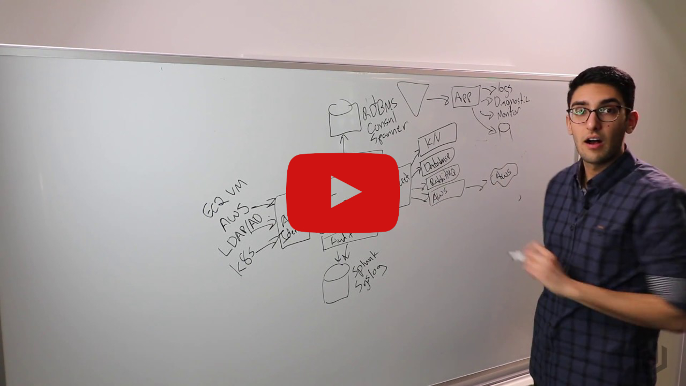

# Vault

<div align="center">
  
  <p><strong>Secure, store and tightly control access to tokens, passwords, certificates, and encryption keys</strong></p>
</div>

## 🚀 Introduction

[HashiCorp Vault](https://www.vaultproject.io/) is a tool for securely accessing secrets. A secret is anything that you want to tightly control access to, such as API keys, passwords, or certificates. Vault provides a unified interface to any secret, while providing tight access control and recording a detailed audit log.

In this HashiQube DevOps lab, you will get hands-on experience with HashiCorp Vault through a UI, CLI, or HTTP API.

<div class="iframe_container">
  <a href="https://www.youtube.com/watch?v=VYfl-DpZ5wM">
    
  </a>
</div>

## 📰 Latest News

- [Vault 1.15 adopts Microsoft Workload Identity Federation](https://www.hashicorp.com/blog/hashicorp-vault-1-15-adopts-microsoft-workload-identity-federation)
- [Vault 1.14 brings ACME for PKI, AWS roles, and more improvements](https://www.hashicorp.com/blog/vault-1-14-brings-acme-for-pki-aws-roles-and-more-improvements)
- [Vault 1.13 adds Kubernetes Operator, MFA improvements, and more](https://www.hashicorp.com/blog/vault-1-13-adds-kubernetes-operator-mfa-improvements-and-more)
- [Vault 1.12 Adds New Secrets Engines, ADP Updates, and More](https://www.hashicorp.com/blog/vault-1-12)
- [Vault 1.11 Adds Kubernetes Secrets Engine, PKI Updates, and More](https://www.hashicorp.com/blog/vault-1-11)
- [Vault 1.10 Achieves FIPS 140-2 Compliance](https://www.hashicorp.com/blog/hashicorp-vault-1-10-achieves-fips-140-2-compliance)

## 🛠️ Provision

<!-- tabs:start -->

### **Github Codespace**

[](https://codespaces.new/star3am/hashiqube?quickstart=1)

```bash
bash vault/vault.sh
```

### **Vagrant**

```bash
vagrant up --provision-with basetools,docsify,vault
```

### **Docker Compose**

```bash
docker compose exec hashiqube /bin/bash
bash hashiqube/basetools.sh
bash vault/vault.sh
```
<!-- tabs:end -->

Once the provisioner has run, you will be able to access vault on <http://localhost:8200>
And you can login with the `Initial Root Token` displayed in the output of the provisioner.

💡 **Tip**: If you ever need to fetch the Initial Root Token again, you can get this inside HashiQube by doing:

- `vagrant ssh`
- `cat /etc/vault/init.file`

<div align="center">
  
</div>

## 📊 Vault Replication Types

Vault supports two types of replication:

### Performance Replication

Performance Replication allows multiple clusters to be simultaneously active in different geographical regions so applications can interact with nearby Vault servers, reducing latency when requesting secrets.

- One cluster is primary, others are secondary
- All clusters can service read requests
- Write requests are forwarded to the primary cluster
- Data flows from primary to secondary clusters

**Key Concepts**:

- **Mount Filter**: Configuration telling the primary cluster which secrets engines and auth methods should have their data replicated to specific secondary clusters
- **Path Filter**: Generalization of a mount filter that can filter both mounts and namespaces in Vault Enterprise
- **Local Mount**: A secret engine or auth method that is designated as local when created; its data is not replicated to other clusters

### Disaster Recovery Replication

In Disaster Recovery Replication, only one cluster is active while the other secondary clusters serve as warm standbys in case the primary cluster suffers a catastrophic failure.

**Note**: Both kinds of replication can be used simultaneously.

## 🔒 Vault Policy Syntax

Policies define access permissions to paths in Vault. When there are potentially multiple matching policy paths, P1 and P2, the following matching criteria is applied:

1. If the first wildcard (+) or glob (*) occurs earlier in P1, P1 is lower priority
2. If P1 ends in * and P2 doesn't, P1 is lower priority
3. If P1 has more + (wildcard) segments, P1 is lower priority
4. If P1 is shorter, it is lower priority
5. If P1 is smaller lexicographically, it is lower priority

💡 **Tip**: The glob character is the asterisk (*). It is not a regular expression and is only supported as the last character of the path!

### Capabilities

Each path must define one or more capabilities which provide fine-grained control over permitted (or denied) operations:

- **create** (POST/PUT) - Allows creating data at the given path
- **read** (GET) - Allows reading the data at the given path
- **update** (POST/PUT) - Allows changing the data at the given path
- **patch** (PATCH) - Allows partial updates to the data at a given path
- **delete** (DELETE) - Allows deleting the data at the given path
- **list** (LIST) - Allows listing values at the given path

## 🧩 Vault Policy Example

```hcl
# Manage auth methods broadly across Vault
path "auth/*" {
  capabilities = ["create", "read", "update", "delete", "list"]
}

# Create, update, and delete auth methods
path "sys/auth/*" {
  capabilities = ["create", "update", "delete", "sudo"]
}

# List auth methods
path "sys/auth" {
  capabilities = ["read"]
}

# Create and manage ACL policies
path "sys/policies/*" {
  capabilities = ["create", "read", "update", "delete", "list"]
}

# To list policies - Step 3
path "sys/policies/" {
  capabilities = ["list"]
}

# List, create, update, and delete key/value secrets mounted under secret/
path "secret/*" {
  capabilities = ["create", "read", "update", "delete", "list"]
}

# Additional policy sections are included in the original document
```

## 🏢 Vault Namespaces

Vault Enterprise Namespaces allow Vault to support multi-tenant deployments in which different teams are isolated from each other and can self-manage their own secrets.

Namespaces form a hierarchy with all namespaces living under the "root" namespace. Each namespace can have its own:

- Secrets engines
- Auth methods
- Policies
- Identities
- Tokens

## 📊 Monitoring Vault

We use Prometheus and Grafana to Monitor Vault. See [Monitoring Hashicorp Vault](prometheus-grafana/README?id=monitoring-hashicorp-vault) for details.

## 📚 Resources

- [HashiCorp Vault Official Website](https://www.vaultproject.io/)

## 🔧 Provisioner Script

Check the complete Vault provisioner script:

```bash
# Script content available in the original file: vault.sh
```
