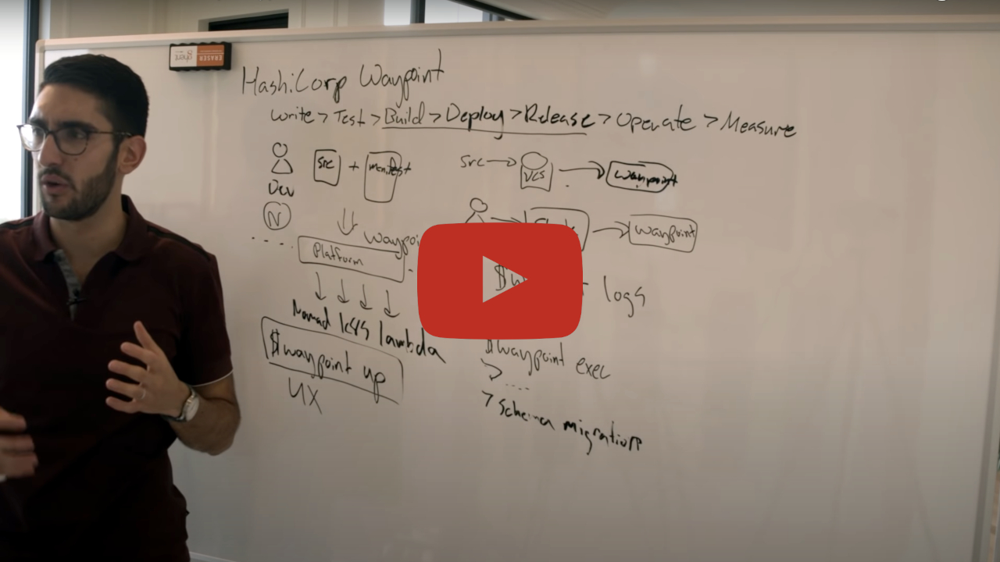

# Waypoint

<div align="center">
  
  <p><strong>A consistent developer workflow to build, deploy, and release applications across any platform</strong></p>
</div>

## 🚀 Introduction

In this HashiQube DevOps lab you will get hands-on experience with HashiCorp Waypoint. Waypoint provides a unified workflow for build, deploy, and release across platforms.

<div class="iframe_container">
  <a href="https://www.youtube.com/watch?v=JL0Qeq4A6So">
    
  </a>
</div>

Waypoint supports multiple platforms:

- aws-ec2
- aws-ecs
- azure-container-instance
- docker
- exec
- google-cloud-run
- kubernetes
- netlify
- nomad
- pack

<div align="center">
  
</div>

## 📰 Latest News

- [Waypoint 0.11 strengthens Terraform integrations and allows user API access](https://www.hashicorp.com/blog/waypoint-0-11-strengthens-terraform-integrations-and-allows-user-api-access)
- [Waypoint 0.10 Brings Custom Pipelines and Nomad Plugin Updates](https://www.hashicorp.com/blog/waypoint-0-10-brings-custom-pipelines-and-nomad-plugin-updates)
- [Waypoint 0.9 Adds New Runner Commands](https://www.hashicorp.com/blog/waypoint-0-9-adds-new-runner-commands)

## 🛠️ Waypoint Deployment Options

Waypoint is a firstclass citizen of Hashicorp and runs flawlessly on both Nomad and Kubernetes. Below are instructions for both platforms.

### Waypoint on Nomad

#### Provision

<!-- tabs:start -->

### **Github Codespace**

[](https://codespaces.new/star3am/hashiqube?quickstart=1)

```bash
bash docker/docker.sh
bash nomad/nomad.sh
bash waypoint/waypoint.sh
```

### **Vagrant**

```bash
vagrant up --provision-with basetools,docker,nomad,waypoint
```

### **Docker Compose**

```bash
docker compose exec hashiqube /bin/bash
bash hashiqube/basetools.sh
bash docker/docker.sh
bash nomad/nomad.sh
bash waypoint/waypoint.sh
```
<!-- tabs:end -->

### Waypoint on Kubernetes

#### Provision

<!-- tabs:start -->

[](https://codespaces.new/star3am/hashiqube?quickstart=1)

```bash
bash hashiqube/basetools.sh
bash docker/docker.sh
bash minikube/minikube.sh
bash waypoint-kubernetes-minikube/waypoint-kubernetes-minikube.sh
```

### **Vagrant**

```bash
vagrant up --provision-with basetools,docker,docsify,minikube,waypoint-kubernetes-minikube
```

### **Docker Compose**

```bash
docker compose exec hashiqube /bin/bash
bash hashiqube/basetools.sh
bash docker/docker.sh
bash minikube/minikube.sh
bash waypoint-kubernetes-minikube/waypoint-kubernetes-minikube.sh
```
<!-- tabs:end -->

<div align="center">
  
  
</div>

## 📄 Configuration Examples

### Waypoint Nomad Configuration

The following Waypoint job file will deploy our Nomad T-Rex NodeJS Application to Nomad:

```hcl
project = "nomad-trex-nodejs"

app "nomad-trex-nodejs" {
  labels = {
    "service" = "nomad-trex-nodejs",
    "env"     = "dev"
  }

  build {
    use "docker" {}
    registry {
      use "docker" {
        image = "nomad-trex-nodejs"
        tag   = "1.0.0"
        local = true
      }
    }
  }

  deploy {
    use "nomad" {
      datacenter = "dc1"
      namespace  = "default"
      service_provider = "nomad"
      services = ["nomad-trex-nodejs"]
    }
  }
}
```

### Waypoint Kubernetes Configuration

The following Waypoint job file will deploy our T-Rex NodeJS Application to Kubernetes (Minikube):

```hcl
project = "kubernetes-trex-nodejs"

app "kubernetes-trex-nodejs" {
  labels = {
    "service" = "kubernetes-trex-nodejs",
    "env"     = "dev"
  }

  build {
    use "docker" {}
    registry {
      use "docker" {
        image = "kubernetes-trex-nodejs"
        tag   = "1.0.0"
        local = true
      }
    }
  }

  deploy {
    use "kubernetes" {
      probe_path = "/"
      service_port = 6001
    }
  }
}
```

### T-Rex Dockerfile

Both the Nomad and Kubernetes Applications have a similar Dockerfile:

```Dockerfile
# syntax=docker/dockerfile:1

FROM node:14.20.0

WORKDIR /app

COPY package*.json ./

RUN npm install

COPY . .

RUN echo "nameserver 10.9.99.10" > /etc/resolv.conf

EXPOSE 6001

CMD [ "node", "index.js" ]
```

## 📚 Resources

- [Waypoint Official Website](https://www.waypointproject.io/)
- [Announcing Waypoint](https://www.hashicorp.com/blog/announcing-waypoint)

## 🔧 Provisioner Script

The `waypoint.sh` script handles the setup and configuration of Waypoint:

```bash
# Script content available in the original file: waypoint.sh
```

[filename](waypoint.sh ':include :type=code')

[google ads](../googleads.html ':include :type=iframe width=100% height=300px')
